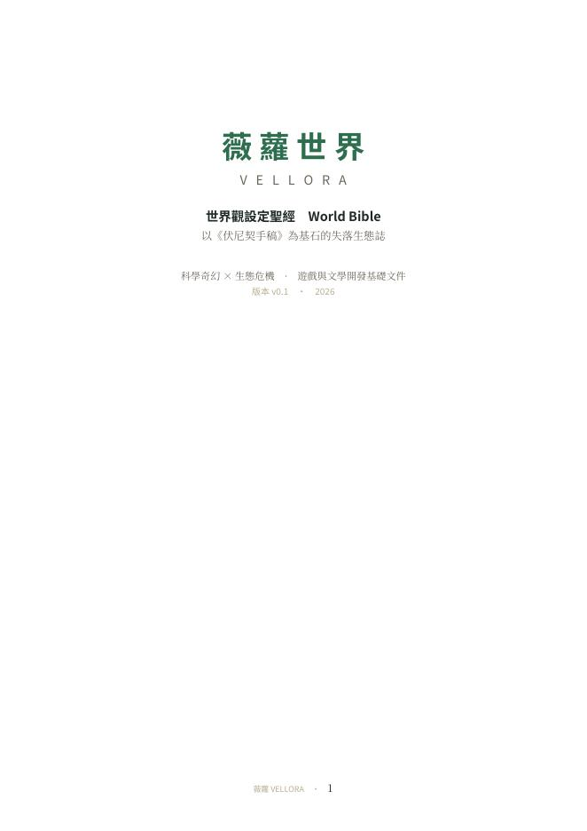
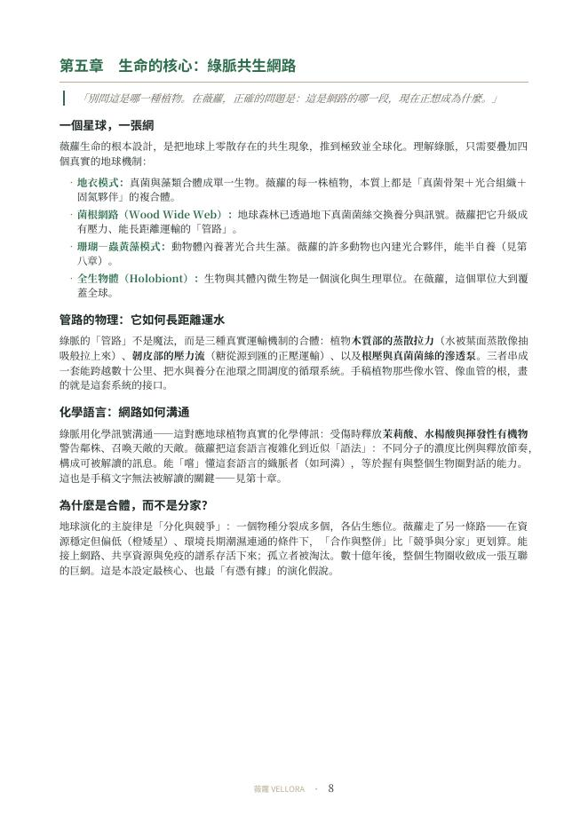
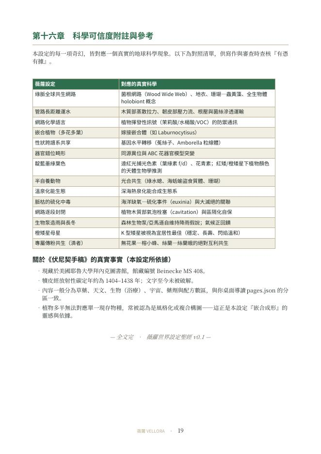

<div align="center">

# VoynichWorld

### 《伏尼契手稿》研究導讀 ＋ 薇蘿世界（VELLORA）世界觀開發

**同一份手稿，兩條路線：一條老老實實地研究它，一條大膽地假設它是真的。**

科學奇幻 × 生態危機　·　研究資料庫、遊戲與文學開發基礎文件



[](LICENSE)


</div>

---

## 目錄

- [這個倉庫是什麼](#這個倉庫是什麼)
- [兩條路線的分工](#兩條路線的分工)
- [路線 A：伏尼契手稿中文導讀](#路線-a伏尼契手稿中文導讀)
- [路線 B：薇蘿世界 VELLORA](#路線-b薇蘿世界-vellora)
- [角色與生態 IP 聖經 v0.2](#角色與生態-ip-聖經-v02)
- [手稿六大分區 → 世界六個面向](#手稿六大分區--世界六個面向)
- [逐頁分區資料](#逐頁分區資料)
- [倉庫結構](#倉庫結構)
- [快速開始](#快速開始)
- [如何重建 Word 檔](#如何重建-word-檔)
- [開發路線圖](#開發路線圖)
- [關於《伏尼契手稿》的真實事實](#關於伏尼契手稿的真實事實)
- [引用原則與免責聲明](#引用原則與免責聲明)
- [授權](#授權)

---

## 這個倉庫是什麼

《伏尼契手稿》（Voynich Manuscript, **Beinecke MS 408**）現藏於耶魯大學拜內克珍本與手稿圖書館，
犢皮經放射性碳定年約為 **1404–1438 年**，至今無人能可靠解讀。它畫滿了對不上任何現存物種的奇異植物、
天文圓盤、泡在水池裡以綠管相連的小人，以及一種沒人讀得懂的文字。

這個倉庫收錄了圍繞這份手稿的**一整系列產出**，並刻意把它們分成兩條**互不污染**的路線：

- **路線 A —— 研究導讀**：只講可查證的事實、主流研究與可執行的研究方法，並明確標示哪些是推測、哪些是都市傳說。
- **路線 B —— 薇蘿世界**：明白地承認自己是虛構創作，但把「如果這些圖是真的呢？」這個假設，用真實的物理、化學與生物學一路推到底。

> 兩條路線共用同一份 209 頁逐頁分區資料（`data/voynich_pages_classification.json`），
> 讓創作端的每一項設定，都能追回到手稿真實的圖版結構上。

---

## 兩條路線的分工

| | 路線 A · 研究導讀 | 路線 B · 薇蘿世界 |
|---|---|---|
| **性質** | 非虛構、研究取向 | 虛構、世界觀開發 |
| **目標** | 分層呈現史料／研究／假說／傳說，並提供可重現的研究流程 | 以真實科學反推一顆失落星球，長出可開發的故事與遊戲 |
| **主要產出** | HTML 導讀 ×2、PDF 印刷版、逐頁分類資料 | 設定聖經（16 章 / Word 19 頁）、docx 產製腳本 |
| **對「破解」的立場** | 尚無被廣泛接受、可重現的完整翻譯 | 設定內給出「為何無法解讀」的虛構解釋，不主張現實中的解答 |
| **入口** | [`guide/`](guide/) · [`guide-full/`](guide-full/) | [`docs/Vellora_WorldBible_v0.1.md`](docs/Vellora_WorldBible_v0.1.md) |

---

## 路線 A：伏尼契手稿中文導讀

一份**研究與應用型**導讀，適用於閱讀、影片腳本、AI Agent 知識庫與後續逐頁研究。
它把可靠史料、主流研究、爭議假說與可執行研究方法**分層**呈現——事實、推測、都市傳說不混寫。

### A-1　第一版（章節導讀）　→ [`guide/`](guide/)

| 檔案 | 說明 |
|---|---|
| [`guide/index.html`](guide/index.html) | 可搜尋 HTML 導讀，單檔離線可用，含章節即時過濾 |
| [`guide/伏尼契手稿中文導讀_第一版.pdf`](guide/) | 固定排版印刷版，14 頁 |
| `guide/assets/folio33.jpg` | 植物頁示例圖（公有領域原作） |

**十四個章節**：一分鐘認識它 · 流傳史與年代 · 手稿的六大區段 · 神祕植物到底是什麼 ·
未知文字與統計規律 · 主要破解理論評估 · 常見都市傳說核對 · 如何自己閱讀原稿 ·
示範頁導讀 · AI 研究工作流 · 後續資料庫規格 · 驗收標準 · 名詞表 · 參考資料

導讀中幾個核心判斷：

- **「畫中植物無法確認」 ≠ 「它們一定是地球上已滅絕或不存在的植物」**。更保守的解釋包括中世紀風格化描繪、
  多物種部件拼合、抄本轉抄失真、象徵／記憶圖，或作者刻意創造的分類圖。
- **EVA（Extensible Voynich Alphabet）是轉寫，不是翻譯。** 把字形映射成拉丁字母代碼只是為了計算分析。
- 「真正破解」應通過的測試：事先固定規則 → 未參與建模的頁面盲測 → 跨頁語義一致 →
  與圖像／文法／年代／物質文化同時相容 → 由獨立研究者重現。

### A-2　完整圖版版（逐頁瀏覽）　→ [`guide-full/`](guide-full/)

| 檔案 | 說明 |
|---|---|
| [`guide-full/index.html`](guide-full/index.html) | 209 頁逐頁瀏覽器，可依頁碼、分區與關鍵字即時篩選 |
| [`guide-full/pages.json`](guide-full/pages.json) | 逐頁分類資料（與 `data/` 同源） |
| `guide-full/assets/pages/` | 209 張掃描衍生圖 `page-001.jpg` … `page-209.jpg` |

---

## 路線 B：薇蘿世界 VELLORA

**一部把世界上最神秘的手抄本，重新詮釋為「一顆失落星球的田野筆記」的世界觀開發專案。**

我們不試圖「破解」它，而是反過來問：**如果這些圖是真的呢？**

設定中，手稿是**一位名叫珂潾（Korin）的博物學者，在一顆環繞橙矮星的星球「薇蘿（Vellora）」上，
於生態總崩潰（脈枯）來臨前留下的真實田野筆記**。在此前提下，我們用真實的物理、化學與生物學，
反推出這個世界的恆星、氣候、地質、植物成因、動物群、智慧種族、危機與故事。

> **核心創作原則**：奇幻只出現在「我們尚未知道的地方」，不出現在「我們已知會被違反的地方」。
> 每一項看似魔法的設定，背後都對應一個真實的地球科學現象。

### 一分鐘看懂薇蘿

| 主題 | 設定 | 對應的真實科學 |
|---|---|---|
| **母星** | 橙矮星「歐柯」，偏紅、暗、壽命極長 | K 型矮星被視為宜居性最佳（穩定、長壽、閃焰溫和） |
| **生命核心** | 全球生命是一張互聯共生網路「綠脈」 | 菌根網路（Wood Wide Web）、地衣、珊瑚共生、全生物體 holobiont |
| **植物為何怪** | 每株都是多譜系融合的「拼裝體」 | 嫁接嵌合體、基因水平轉移、共生器官、同源異位畸形 |
| **葉子為何藍綠** | 弱紅光下需額外補光色素 | 遠紅光捕光色素（葉綠素 f/d）＋花青素 |
| **水池與潾者** | 半透明兩棲生物，是網路的「行動生殖系統」 | 無花果—榕小蜂式的絕對互利共生 |
| **末世危機「脈枯」** | 網路中毒栓塞、逐段斷裂、世界滑入長冬 | 海洋缺氧硫化事件（euxinia）、木質部氣泡栓塞、氣候正回饋 |
| **手稿為何無法解讀** | 織脈者的文字是「多通道書寫」，一半資訊編碼在化學殘留裡 | 呼應手稿真實的統計異常（有語言規律卻對不上任何語音系統） |

主角 **珂潾** 是能用舌與掌「嚐」懂綠脈化學語言的記錄者；她追尋失蹤導師與傳說中的「原脈」，
最終要在三大勢力（**焚脈／融脈／記脈**）之間，替整個世界做出選擇——這也構成遊戲的多結局。

### 角色與生態 IP 聖經 v0.2

<div align="center">

</div>

[`ip-bible/`](ip-bible/) 把 v0.1 世界設定擴充成可直接供概念設計、小說、遊戲、動畫與授權使用的
**角色與生態 IP 規格**：

- 完整覆蓋歐柯系、薇蘿、三衛星、九大池環、綠脈、脈枯與原脈留白。
- 逐一建立全部具名植物（鐘管草、縫葉、燼冠）與動物（潾者、拱背獸、燈蛾群、汲蟲、裂獸）的
  外形、生理、生態位、性格印象、聲音、動態與危機狀態。
- 逐一建立全部具名角色（珂潾、燼、漣、奧芮、穹母）的個性、弱點、弧線、關係與表演規格。
- 收錄 12 張原創概念圖、三勢力服裝、織脈者解剖、製作 QA、圖像提示集與機器可讀實體索引。
- 以 A／B／C／D 四層標示原始正典、必要推導、製作提案與刻意留白，避免虛構延伸冒充手稿內容。

### 設定聖經內容（19 頁 / 16 章）

完整內容見 **[`docs/Vellora_WorldBible_v0.1.md`](docs/Vellora_WorldBible_v0.1.md)**（可在 GitHub 直接閱讀），
Word 排版版見 [`docs/Vellora_WorldBible_v0.1.docx`](docs/Vellora_WorldBible_v0.1.docx)。

| # | 章節 | 對應手稿分區 |
|---:|---|---|
| 0 | 序章：一頁犢皮上的世界（世界描述短篇） | — |
| 1 | 設定總覽與核心概念 | — |
| 2 | 天文與行星系統 | 天文／占星圖版 |
| 3 | 地質與地理 | 宇宙／大型摺頁圖版 |
| 4 | 氣候系統 | — |
| 5 | 生命的核心——綠脈共生網路 | — |
| 6 | **植物的形成機制**（重點章，含「特徵 → 成因」對照表） | 植物／草藥圖版 |
| 7 | 色素、毒素與藥理 | 藥劑／植物部件圖版 |
| 8 | 動物群與生態系 | 浴療／生物圖版 |
| 9 | 生態危機——脈枯（末世主線） | 星號段落／配方區 |
| 10 | 智慧種族與勢力 | — |
| 11 | 主角與角色群 | — |
| 12 | 故事主線與三幕大綱 | — |
| 13 | 手稿如何抵達地球（元設定與留白） | — |
| 14 | 當時的地球是什麼樣子（真實對照） | — |
| 15 | 遊戲與文學延展建議 | — |
| 16 | 科學可信度附註與參考 | — |

<div align="center">


<br><sub>內頁樣張：第五章綠脈共生網路 · 第十六章科學可信度附註對照表</sub>
</div>

---

## 手稿六大分區 → 世界六個面向

本設定刻意讓手稿真實的圖版結構，一一對應世界的知識領域，讓整份設定與真實文物嚴密咬合：

| 手稿真實分區 | 頁數 | 在薇蘿世界中的意義 |
|---|---:|---|
| 植物／草藥圖版 | 116 | 綠脈植物形態圖鑑：拼裝體、管路根、共生花 |
| 藥劑／植物部件圖版 | 21 | 植物部件的化學與藥理：色素、毒素、次級代謝物 |
| 天文／占星圖版 | 21 | 恆星、衛星與軌道週期：氣候與潮汐的曆法 |
| 浴療／生物圖版 | 20 | 水池生態與潾者：網路的繁殖與傳播機制 |
| 星號段落／配方區 | 15 | 記錄者的實驗與對策：保種、解毒、脈枯應變 |
| 宇宙／大型摺頁圖版 | 13 | 全球地理與板塊：環狀大陸與大池的地圖 |
| 館藏與裝幀 | 3 | （非內容頁，不作設定推定） |

> 頁數依 `data/voynich_pages_classification.json` 統計，合計 **209** 頁；分區為既有詮釋框架下的歸類，**非原文翻譯**。

---

## 逐頁分區資料

`data/voynich_pages_classification.json` 是兩條路線共用的資料底層，為 209 筆物件陣列：

```json
{
  "scan_page": 4,
  "section": "植物／草藥圖版",
  "description": "大型植物構圖與繞圖書寫。植物通常無法可靠對應單一現存物種，可能包含風格化或複合特徵。",
  "confidence": "中",
  "image": "assets/pages/page-004.jpg"
}
```

| 欄位 | 型別 | 說明 |
|---|---|---|
| `scan_page` | int | 掃描頁序（1–209），**非** folio 編號 |
| `section` | string | 七種分區之一（見上表） |
| `description` | string | 該分區的觀察性描述，不推定原文內容 |
| `confidence` | string | 分類信心：`高` 3 頁 · `中` 193 頁 · `低` 13 頁 |
| `image` | string | 相對於 `guide-full/` 的圖檔路徑 |

`guide-full/pages.json` 與此檔內容相同。`guide-full/index.html` 已把所需資料內嵌進頁面，
以確保離線可直接開啟——因此修改分類時，這**三處**都需同步更新。

---

## 倉庫結構

```
VoynichWorld/
├── README.md                                  # 本檔
├── LICENSE                                    # CC BY-NC-SA 4.0（原創設定部分）
├── CHANGELOG.md                               # 版本紀錄
│
├── guide/                                     # 路線 A-1：中文導讀第一版
│   ├── README.md
│   ├── index.html                             # 可搜尋 HTML 導讀（14 章）
│   ├── 伏尼契手稿中文導讀_第一版.pdf            # 印刷版 PDF（14 頁）
│   └── assets/folio33.jpg                     # 植物頁示例圖
│
├── guide-full/                                # 路線 A-2：完整圖版版
│   ├── README.md
│   ├── index.html                             # 209 頁逐頁瀏覽器
│   ├── pages.json                             # 逐頁分類資料
│   └── assets/pages/page-001.jpg … page-209.jpg
│
├── docs/                                      # 路線 B：薇蘿世界設定聖經
│   ├── Vellora_WorldBible_v0.1.md             # Markdown 版（GitHub 可直接閱讀）
│   └── Vellora_WorldBible_v0.1.docx           # Word 排版版（19 頁）
│
├── ip-bible/                                  # v0.2 角色與生態 IP 聖經
│   ├── README.md                              # 導覽、覆蓋清單與圖像索引
│   ├── 00-visual-language.md … 08-production-guide.md
│   └── IMAGE_PROMPTS.md                       # 可重現圖像提示集
│
├── data/
│   ├── voynich_pages_classification.json      # 209 頁逐頁分區資料（設定所依據）
│   └── vellora_ip_entities_v0.2.json           # IP 實體機器可讀索引
│
├── tools/
│   └── build_vellora.js                       # 由內容產生 Word 檔的 docx-js 腳本
│
└── assets/
    ├── cover.jpg                              # 設定聖經封面
    ├── sample_ch5.jpg                         # 內頁樣張：綠脈共生網路
    ├── sample_science_notes.jpg               # 內頁樣張：科學可信度附註對照表
    └── ip-bible/                              # 12 張角色、生物、環境與世界概念圖
```

---

## 快速開始

### 只想閱讀

| 我想看… | 去這裡 |
|---|---|
| 手稿到底是什麼、目前研究到哪 | [`guide/index.html`](guide/index.html)（下載後用瀏覽器開） |
| 逐頁翻 209 頁圖版 | [`guide-full/index.html`](guide-full/index.html) |
| 世界觀設定全文 | [`docs/Vellora_WorldBible_v0.1.md`](docs/Vellora_WorldBible_v0.1.md) |
| 全角色、動植物、星球、地貌與氣候 IP 設定 | [`ip-bible/README.md`](ip-bible/README.md) |
| 可列印的 PDF | [`guide/伏尼契手稿中文導讀_第一版.pdf`](guide/) |

### 在本機跑起來

兩份 HTML 都是**單檔、無外部相依、離線可用**——分區資料已內嵌在 HTML 中，
直接雙擊用瀏覽器開啟即可（`pages.json` 是給程式再利用的獨立資料，頁面本身不需要載入它）。

若想以 HTTP 方式瀏覽整個倉庫：

```bash
git clone https://github.com/pcpcchen-coder/VoynichWorld.git
cd VoynichWorld
python3 -m http.server 8000
# 章節導讀：http://localhost:8000/guide/
# 逐頁圖版：http://localhost:8000/guide-full/
```

### 發佈成網站

倉庫本身就是純靜態內容，可直接開 GitHub Pages：
**Settings → Pages → Source: Deploy from a branch → `main` / `/ (root)`**，
發佈後即可透過 `/guide/` 與 `/guide-full/` 存取。

---

## 如何重建 Word 檔

設定聖經的 Word 版由 `tools/build_vellora.js` 以 [docx-js](https://github.com/dolanmiu/docx) 產生。
需要 Node.js 與 `Noto Serif/Sans CJK TC` 字型：

```bash
cd tools
npm install docx          # 若環境未預裝
node build_vellora.js     # 產生 薇蘿世界設定聖經_v0.1.docx
```

如需轉為 Markdown：`pandoc -t gfm 薇蘿世界設定聖經_v0.1.docx -o out.md`

---

## 開發路線圖

**路線 A · 研究導讀**

- [x] **v0.1** 章節導讀（HTML ＋ PDF）與研究原則
- [x] **v0.1** 209 頁逐頁分區資料與圖版瀏覽器
- [ ] 逐頁 Markdown 註解（`notes/f001r.md …`，含觀察／推測／反證分層）
- [ ] folio 編號對照（`scan_page` → `f1r/f1v`）與書帖、抄寫者欄位
- [ ] EVA 轉寫對齊與 token 級資料表
- [ ] 植物部件切分與相似檢索索引
- [ ] 假說評測框架（訓練集／留出集、可重現分數）

**路線 B · 薇蘿世界**

- [x] **v0.1** 世界觀設定聖經（16 章）
- [x] **v0.2** 角色與生態 IP 聖經：全具名角色／動植物、星球地貌氣候、12 張概念圖、實體索引
- [ ] **植物圖鑑**：把手稿植物逐頁重畫為「拼裝體」條目，做成可收集的偽手稿圖版
- [ ] **逐隻動物設定畫冊**：由 v0.2 角色板擴成多姿態、生命階段與棲地頁
- [ ] **遊戲核心玩法文件**：「嚐味診斷」機制、探索循環、多結局分支
- [ ] **序章短篇小說**（由設定聖經序章擴寫）
- [ ] **conlang（織脈者文字）** 的多通道書寫系統原型

---

## 關於《伏尼契手稿》的真實事實

以下是路線 B 全部設定所依據、且**在現實中可查證**的部分：

- 現藏於美國耶魯大學拜內克古籍善本圖書館，館藏編號 **Beinecke MS 408**。
- 犢皮經放射性碳定年約為 **1404–1438 年**；這是**材料年代**，不必然等於書寫年份。
- 文字（研究者常暫稱 **Voynichese**）至今未被可靠解讀；作者、語言與用途均無定論。
- 內容一般分為草藥、天文／占星、生物（浴療）、宇宙、藥劑與配方數區。
- 植物多半無法對應單一現存物種，常被認為是風格化或複合構圖——這正是本設定「嵌合成形」的靈感與依據。
- 1912 年由古書商 Wilfrid M. Voynich 購得；1969 年入藏 Beinecke。

### 參考資料

1. Yale Beinecke Rare Book & Manuscript Library, *The Beinecke Cipher (Voynich) Manuscript*, MS 408 —
   <https://beinecke.library.yale.edu/collections/highlights/voynich-manuscript>
2. René Zandbergen, *Voynich Manuscript* research site（圖版、歷史、碳定年與書目）— <https://www.voynich.nu/>
3. University of Arizona / Phys.org, *Experts determine age of book nobody can read*（2011，關於放射性碳定年）—
   <https://phys.org/news/2011-02-experts-age.html>
4. Rachel Sterneck, Annie Polish, Claire Bowern, *Topic Modeling in the Voynich Manuscript*（2021）—
   <https://arxiv.org/abs/2107.02858>
5. Arthur O. Tucker & Jules Janick, *Flora of the Voynich Codex*（Springer）—
   <https://link.springer.com/book/10.1007/978-3-030-19377-5>
6. *Botanists suggest Voynich plants similar to Mexico*（phys.org）—
   <https://phys.org/news/2014-02-botanists-voynich-similar-mexico.html>
7. *Voynich manuscript*（Wikipedia）— <https://en.wikipedia.org/wiki/Voynich_manuscript>
8. Wikimedia Commons, *Voynich Manuscript (33).jpg*（公有領域重製，來源 Yale Beinecke）—
   <https://commons.wikimedia.org/wiki/File:Voynich_Manuscript_(33).jpg>

---

## 引用原則與免責聲明

- **編輯原則**：優先採用館藏機構、材料研究與可重現的計算研究。對未經同行評審或無法覆蓋全書的
  「破解」主張，只作為**假說紀錄**，不視為定論。
- **分層要求**：事實、推測、都市傳說不混寫。任何結論都應附來源、反證與信心分數。
- **虛構聲明**：`docs/` 下的薇蘿世界設定（薇蘿、綠脈、脈枯、珂潾、織脈者、焚脈／融脈／記脈等）
  **全部為原創虛構**，不是對手稿的翻譯、解讀或學術主張，也**不應**被引用為手稿內容的證據。
- **分區聲明**：`data/` 與 `guide-full/` 的逐頁 `section` 為初始分類，**並非文字翻譯**。

---

## 授權

本專案的**原創世界觀設定、文字與故事**（薇蘿、綠脈、脈枯、珂潾等）以
**[CC BY-NC-SA 4.0](LICENSE)** 授權：可自由分享與改作，須標示出處、非商業使用、以相同方式分享。
商業授權（遊戲／出版）請另洽作者。

《伏尼契手稿》原件為公共領域文物；本專案僅以其為靈感與研究對象，不主張對原件的任何權利。
`guide/assets/` 與 `guide-full/assets/` 下的圖像衍生自公有領域重製品（Wikimedia Commons / Yale Beinecke）。

---

<div align="center">
<sub>VoynichWorld · 導讀 v0.1 ＋ 薇蘿 VELLORA World Bible v0.1 · 一份訃聞，也是一張種子清單</sub>
</div>
