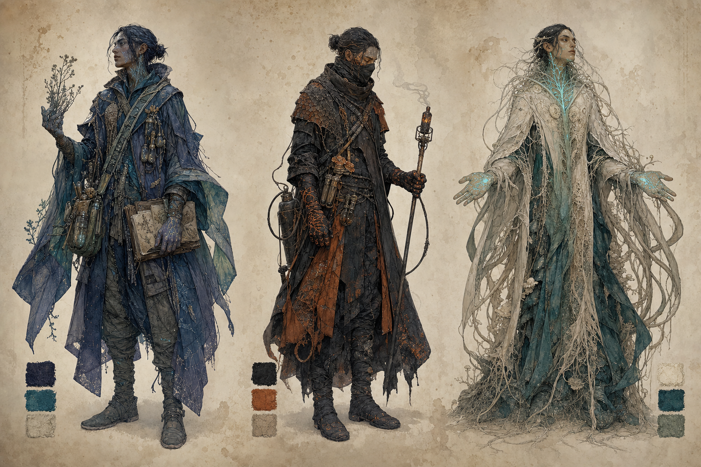

# 00｜視覺語言與 IP 辨識系統

## 一、辨識核心

薇蘿的畫面必須同時具備三種感受：

1. **自然史的可信度**：每個器官都像有功能，不是任意裝飾。
2. **共生的親密感**：植物、動物、土壤、衣物與工具互相接續，少見完全封閉的硬表面。
3. **訃聞般的美**：美麗不是無憂；健康區的每一束光都應讓人想到它可能熄滅。

最簡單的自我檢查是：把角色剪成黑色剪影，是否仍能從管路根、背部花園、透明身體或共生衣料判斷「這只能來自薇蘿」？

## 二、主色與功能色

| 色彩 | 建議色值 | 世界內成因 | 使用規則 |
|---|---|---|---|
| 歐柯橙 | `#D66A32` | K 型橙矮星光 | 天空、輪廓光、時間感；不當警告色 |
| 深靛葉 | `#172A46` | 遠紅光捕光與花青素 | 健康植被主色，取代地球常見鮮綠 |
| 礦物青 | `#2B7D79` | 溫泉、共生藻、濕潤組織 | 水、黏液、活土與記脈院 |
| 脈光青 | `#73D6D0` | 化學訊號與生物發光 | 少量高亮；不可像電子 LED |
| 骨紙白 | `#D8CCB3` | 犢皮、菌絲、乾燥膜衣 | 文件底色、融脈教、老化組織 |
| 管路銅 | `#98613C` | 富礦物導管與色素沉積 | 根部、接口、工具；必須保持有機纖維感 |
| 燼灰黑 | `#292B2C` | 隔離、炭化、封閉管段 | 焚脈派、脈枯封鎖線 |
| 硫病紅 | `#A64232` | 硫代謝失控與發熱 | 只用於燼冠、裂獸、脈枯警告；越少越有效 |

### 色彩禁忌

- 健康植被不可整片地球草綠。
- 脈光不可成為科幻電路；它應沿血管、菌絲、黏液與葉脈自然漫射。
- 脈枯不是火山末日；紅色代表發熱、硫代謝與病變，不代表岩漿。
- 三勢力不可用「好人白／壞人黑」簡化。記脈院也有沾污與磨損，焚脈派也保留暖色與保護性細節，融脈教必須既安詳又令人不安。

## 三、形狀語彙

| 系統 | 主形狀 | 情緒 |
|---|---|---|
| 綠脈／健康生態 | 分岔、吻合、環、海綿孔、縫合線 | 互助、流動、呼吸 |
| 記脈院 | 開放弧線、可拆小容器、頁片、種莢 | 觀察、保存、尚未完成 |
| 焚脈派 | 截斷、夾鉗、封套、窄長防火帶 | 決斷、保護、代價 |
| 融脈教 | 同心層、膜、重疊臉、向下延伸的根絲 | 安寧、誘惑、個體消融 |
| 脈枯 | 失去對稱的膨脹、斷裂、塌陷、空腔 | 發燒、缺氧、孤立 |

## 四、材質

### 活體材質

- **健康導管**：像纖維化的藤、木質部與軟骨混合；濕潤、有彈性，絕非黃銅機械管。
- **活土**：切面像多孔肌理與海綿，會緩慢滲出青色汁液；可見菌絲編網但不血腥。
- **共生衣料**：菌絲氈、纖維束、半透膜與經處理的植物韌皮；可修補、可長合，邊緣不必整齊。
- **潾者皮膚**：珍珠半透明，內部藻脈柔和可見，水中比岸上明亮。

### 非活體材質

- 犢皮、礦物顏料、陶質藥瓶、石與木可存在，但工藝應順著生物形狀，不應壓成標準工業幾何。
- 金屬稀少且珍貴，多以細箍、刀口、燒灼端或耐熱扣件出現。

## 五、鏡頭與光

- **健康區**：長黃昏、低角度歐柯光、霧內散射、近景生物光。反差柔和，但黑位保持深靛。
- **脈枯區**：霧退、天空變空、陰影變硬；不是單純「整張變灰」，而是水分與色彩從畫面上被抽走。
- **人物特寫**：手掌、舌、頸側脈紋是織脈者的辨識重點；拍攝時至少保留一處。
- **潾者**：鏡頭維持其尊嚴與非情色性。牠們是生態信使與親族，不是水中裸體人類。

## 六、字體與版面

圖像本身盡量不內嵌文字；IP 文件以外部排版標註，避免生成式圖像的錯字。正式版建議：

- 中文標題：思源宋體／Noto Serif CJK TC，寬字距。
- 中文內文：思源黑體／Noto Sans CJK TC。
- 英文學名與代號：小型大寫、寬字距，保持標本標籤感。
- 版面：骨紙白底、深靛字、礦物青細線；硫病紅只用於危機註記。

## 七、全案不可偏移項

1. 所有植物根部都必須呈現「接口」而不是普通鬚根。
2. 動物的半自養性必須在外形或行為上留下光合共生痕跡。
3. 怪物必須能看出「原本溫馴」的殘影。
4. 魔法視覺一律改寫為化學、流體、光合、共生或地質機制。
5. 不把任何現實民族服飾直接套到織脈者身上。
6. 不把融脈教畫成邪教怪物，也不把焚脈派畫成單純法西斯反派；衝突來自可辯護的生存倫理。
