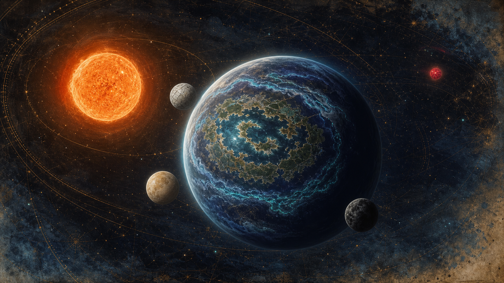

# 01｜天文、行星與天空

## 一、歐柯系總覽

| 天體 | 正典資料 | 可見樣貌 | 敘事作用 |
|---|---|---|---|
| **歐柯 Oq** | K 型橙矮星；約 0.7 太陽質量；約 4,500 K | 橙紅、穩定、日輪較柔和 | 讓生命有極長演化時間，也造成遠紅光環境 |
| **歐墨 Om** | 遙遠紅矮伴星；數百年級相對週期 | 平時是一顆顯眼紅星，迫近期更醒目 | 軌道與輻射擾動疊加，推動長冬下行段 |
| **薇蘿 Vellora** | 約 1.1–1.2 地球質量；厚、濕潤大氣；32 地球小時一日；軸傾約 12° | 靛藍植被、礦物青內海、雲霧帶和環狀陸地 | 全球共生網路與故事舞台 |
| **稜** | 三衛星之一 | 淡色、有明顯稜面感 | 可作最短節律的「切分月」 |
| **珂** | 三衛星之一 | 暖象牙色、視直徑居中 | 與日常池潮、繁殖窗口關聯最深 |
| **墨** | 三衛星之一 | 小而深色 | 難見但對複合潮汐有關鍵修正 |

衛星的精確尺寸、半長軸與軌道共振在 v0.1 尚未定義，本版不偽造數值。正式硬科幻化時，應以「可形成數日到數十日複合潮汐、且長期軌道穩定」為約束反推。

## 二、薇蘿行星外觀

### 從太空看

- 大陸不是地球式離散塊狀，而呈破碎環、弧與相扣帶，包圍溫暖內海。
- 藍黑—靛色陸表是遠紅光捕光植被的整體反射。
- 青色細線不是城市燈，而是高活性濕地、溫泉與大規模生物發光帶。
- 雲層在健康池環上方更厚，形成「生命自己畫出的氣候地圖」。
- 脈枯區會先出現雲量缺口，再出現赭色乾化帶；它不是瞬間燒黑。

### 地表重力與身體

1.1–1.2 地球質量不等於必然高重力，仍取決於半徑與密度。製作上採取**略高於地球、但不妨礙直立行走**的感受：

- 植物偏低重心、根基寬、枝條柔韌。
- 拱背獸有多肢與寬足，背部花園緊貼軀幹。
- 織脈者身材多精實、動作穩，長途裝備沿軀幹分散重量。

這是 B 層必要推導，不指定精確 `g` 值。

## 三、一天 32 小時

### 建議分段

| 時段 | 約略體感 | 生態事件 |
|---|---|---|
| 長晨 | 低角橙光、霧最厚 | 鐘管草以水位與共鳴同步開花；記脈者採集露液 |
| 高照 | 光弱於地球正午但持續較久 | 光合組織穩定輸糖；拱背獸遷移修剪 |
| 長昏 | 橙光拉長、靛葉顯深 | 燈蛾群與發光花進入授粉高峰 |
| 深夜 | 三月亮輪替，池潮變化清楚 | 潾者跨池播遷；綠脈化學訊號最易被讀取 |

「黃昏」是品牌最重要的時間感：足夠長，讓生物發光不是黑暗中的裝飾，而是光線逐步交棒的語言。

## 四、季節與天文週期

### 短週期：三月複合潮

- 數日到數十日。
- 決定水池之間何時連通、潾者何時遷移、孢子何時釋放。
- 織脈者的曆法優先記「水何時能走」，不是抽象日期。

### 中週期：霧季與清季

- 軸傾只有約 12°，四季溫差較溫和。
- **霧季**：蒸散高、池環連通、病原也較易跨網傳遞。
- **清季**：霧薄、日夜溫差稍大，是修補導管、曝曬藥材與遠距觀測的時期。

### 長週期：歐墨迫近與長冬

長冬不是「突然下大雪」，而是：

1. 輻射與軌道擾動造成溫度、日照小幅下行。
2. 蒸散下降，生物泵造雲變弱。
3. 降雨減少，地下水流速降低。
4. 缺氧產硫微生物爆發，綠脈中毒與栓塞。
5. 霧再減、地表再乾，形成正回饋。

因此天文只是一記輕推；真正讓世界倒下的，是高度整合生物圈的內部回饋。

## 五、天空辨識物

- **雙色天光**：歐柯的橙紅與生物光的冷青並存。
- **三月不同步**：同一畫面可見兩月，第三月未升；不要總畫成整齊排列。
- **歐墨紅點**：大多數時候只是遠方一點，越靠近長冬時代越具心理壓迫。
- **霧中孢光**：看似綠霧，實為細小發光繁殖體與水滴共同散射。

## 六、不可偏移項

- 歐柯不是紅巨星，也不是高爆發紅矮星。
- 薇蘿沒有行星環的正典設定。
- 三衛星不是黃道神祇；它們的文化意義來自潮汐、生殖與運輸。
- 長冬不能只用雪與寒冷表現；「霧消失、水不再流」才是主要恐懼。
