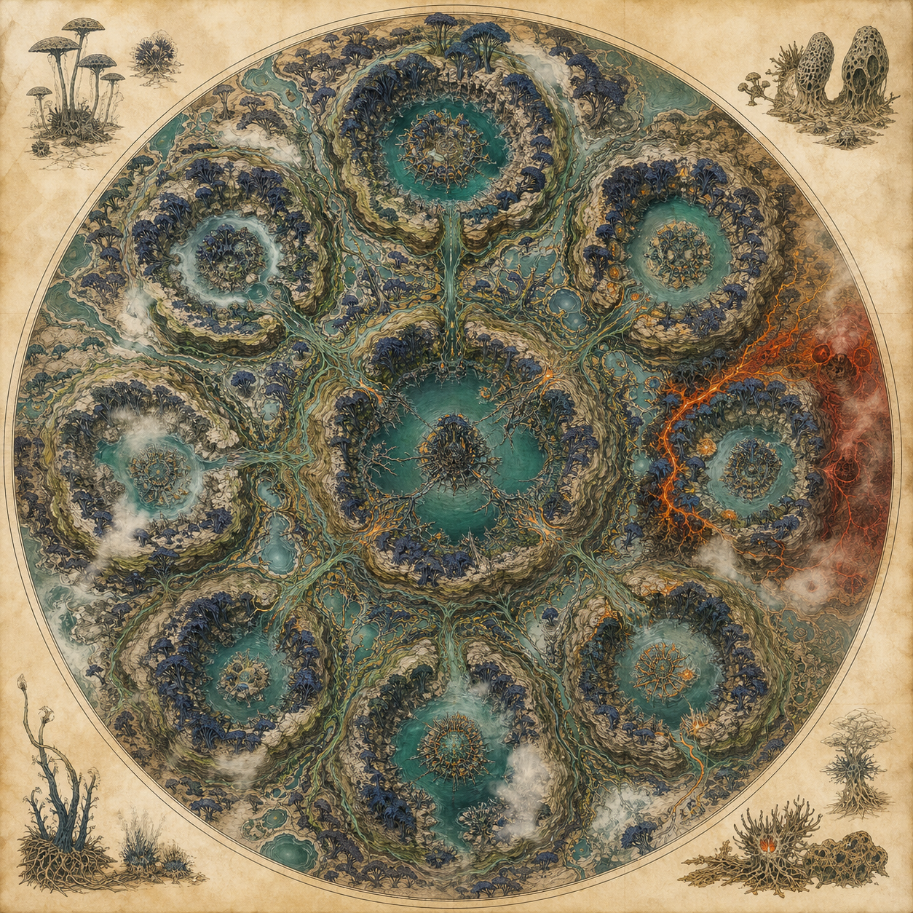
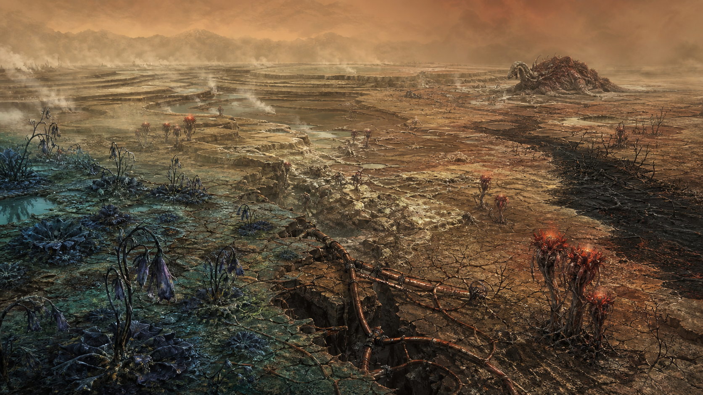

# 02｜地理、地貌、氣候與九大池環

## 一、全球地形骨架

薇蘿的板塊在地函熱柱上方緩慢張裂與聚合，長期塑造出**環狀大陸—內海—潟湖—裂谷溫泉**的連續系統。每一個池環既是地理單位，也是綠脈的生理區室：

- 高地弧像保護池子的肋骨。
- 內海儲熱，減少日夜溫差。
- 裂谷把礦物與化學能帶上地表。
- 潟湖和活土是綠脈的交換面。
- 地下導管穿越地表分水嶺，使「水文流域」和「生物脈區」不完全重合。

## 二、九大池環

v0.1 只確立「九大池環」，未命名各環。下表是 v0.2 的 **C 層製作暫名**，讓地圖、關卡與小說有一致稱呼；日後可改名，但應保留九種生態功能。

| # | 暫名 | 地貌與氣候 | 旗艦生物 | 故事／玩法功能 |
|---:|---|---|---|---|
| 1 | **初泉環** | 熱柱上方的階梯泉與礦物台地；霧熱、含礦高 | 儲水共生體、汲蟲 | 教學區；理解活土與溫泉化能 |
| 2 | **霧冠環** | 高弧山脊攔截水氣；樹冠長年浸雲 | 發光菌落、燈蛾群 | 垂直探索、霧中導航、採光色素 |
| 3 | **鐘潮環** | 潮差最大、池口狹長、風洞多 | 鐘管草、潾者 | 聲音解謎、潮汐曆、脈堵診斷 |
| 4 | **縫林環** | 多層拼裝林與慢流沼澤；光譜斑駁 | 縫葉 | 嫁接、性狀交換、藥理與倫理 |
| 5 | **脊園環** | 開闊濕原與低矮林島；遷徙廊道寬 | 拱背獸 | 伴隨獸群遷移、修復被阻斷的園丁路線 |
| 6 | **燈沼環** | 長夜濕地、黑水池、螢光花密集 | 燈蛾群、潾者 | 夜間授粉、視覺訊號、靜默潛行 |
| 7 | **靛丘環** | 富含色素礦物的起伏丘陵；清季較長 | 藥用拼裝植物 | 顏料、藥材、種源庫與記脈院核心 |
| 8 | **硫裂環** | 年輕裂谷、地下水易缺氧；硫泉與乾霧交錯 | 燼冠、裂獸、汲蟲死亡帶 | 脈枯前線、焚脈隔離、最危險的化學診斷 |
| 9 | **靜心環** | 地理中心的深內海與古老導管匯流處 | 古老綠脈組織 | 原脈謎題入口；不可直接等同原脈 |

「原脈」可能不是地點，所以靜心環只能是**線索匯流處**，不能在地圖上把原脈畫成寶藏座標。

## 三、代表地貌

### 1. 池階

溫泉在多孔活土與礦物殼間形成階梯池。健康時，池緣柔韌、會緩慢收縮調節水位；脈枯時，邊緣乾裂成脆片。

### 2. 脈橋

巨大根—菌絲複合體跨越水道，既是生物導管，也是動物遷徙路。橋面會被拱背獸修剪，橋腹則住著汲蟲與儲水共生體。

### 3. 環脊

破碎陸環的高地骨架。迎風坡濕潤、背風坡相對清朗；環脊缺口是風、潮與孢子集中通道，也是天然關卡。

### 4. 活土原

地表看似泥炭地，實際是厚達數公尺的共生器官。踩踏會有緩慢回彈，切開會滲液；大型聚落必須以分散式浮基承重，不能鋪滿石板。

### 5. 硫裂與死脈谷

地下循環變慢後，硫化氫沿裂隙逸出。死脈谷的危險首先是缺氧、毒氣與脆弱地表，其次才是裂獸。

## 四、健康氣候

### 常態

- 溫暖、高濕、多霧。
- 厚大氣帶來較柔和的溫度日變化。
- 降水不必總是暴雨；大量水以霧滴、露、池潮與活土滲流移動。
- 植物蒸散構成全球生物泵，生命不是被動接受天氣，而是共同製造天氣。

### 常見天候

| 現象 | 外觀 | 生態意義 |
|---|---|---|
| 孢霧 | 青綠微光漂在低霧中 | 潾者與植物釋放繁殖體，亦可能傳病 |
| 環雨 | 雨帶沿池環弧線移動 | 由連續蒸散與地形抬升共同形成 |
| 暖湧 | 泉溫上升、礦物霧增多 | 化能生態旺盛，也可能預示地下化學改變 |
| 靜潮 | 三月引力短暫互抵，池面異常平 | 播遷停頓，織脈者趁機維修接口 |
| 藍昏 | 歐柯落下後，植被與燈蛾接手照明 | 授粉與化學通訊高峰 |

## 五、脈枯氣候

### 五階段環境演變

1. **味變**：水仍充足，但有金屬鹹、苦、焦味；珂潾能最早察覺。
2. **霧退**：蒸散下降，晨霧邊界後撤；燈蛾與花的光訊號變得過亮。
3. **流慢**：池間水位差消失，厭氧產硫菌增加，汲蟲大量死亡。
4. **封脈**：綠脈自我隔離，中毒區與健康區之間形成硬化斷面。
5. **乾化／野化**：活土失去回彈，縫葉自裂、燼冠發熱、動物進入裂獸狀態。

### 視覺原則

- 從健康到脈枯應呈「青色水域縮小、骨白乾區擴大、少量病紅出現」的梯度。
- 可有焚脈派的窄黑防火帶，但不可把整片脈枯畫成燃燒地獄。
- 最恐怖的聲音不是爆炸，而是鐘管草持續低鳴之後突然停止。

## 六、聚落與移動

v0.1 未定義城市形態；依活土與池環機制，v0.2 採以下 B/C 層原則：

- 聚落小而分散，沿池緣形成可拆卸的「節點」，避免壓壞活土。
- 道路主要是脈橋、池舟、潾者引導的水路與拱背獸遷徙徑。
- 大型永久石城不合世界邏輯；權力中心應是種源庫、池站、隔離門或儀式匯流處。
- 每座聚落都必須看得見「水位尺、味診台、孢子濾幕、種源龕」四種基礎設施。

## 七、地圖製作規則

1. 九環應在生態功能上可辨識，不必畫成九個完美圓。
2. 不畫現代國界；勢力控制以隔離線、種源站與匯流儀式點呈現。
3. 健康區的水文線與地下脈線可以交錯，但必須有節點邏輯。
4. 硫裂環是危機高發區，不是脈枯唯一來源；崩潰可沿網路跨地形傳播。
5. 任何「原脈位置」都只能是角色的假說層，不能成為旁白確證。
