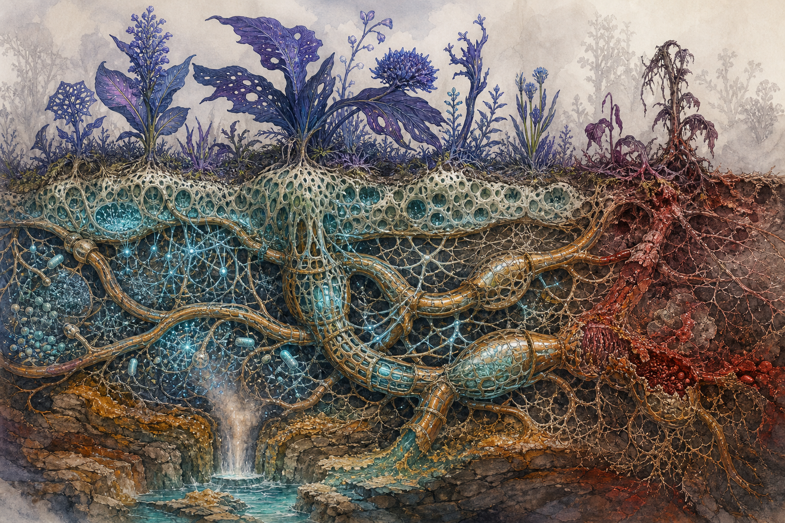

# 03｜綠脈、活土與行星生命系統

## 一、綠脈不是一棵植物

**綠脈（The Chlora）**是橫跨薇蘿的共生基礎設施，也是全案最大的「非人角色」。它由多個生命譜系共同構成，沒有單一大腦，也不是能用一句話回答問題的行星神。

它的角色個性不是人格，而是一組可被觀眾感受到的系統傾向：

- **慷慨**：共享水、糖、礦物、免疫訊號與可用性狀。
- **保守**：面對毒害會封閉管段，寧願犧牲局部。
- **記憶深長**：化學回饋和嫁接史會在組織結構中留下痕跡。
- **不懂個體**：它能維持整體，卻無法自然理解某一個體為何值得被例外拯救。
- **最大的缺點是成功**：整合程度太高，備援太少；一處故障能成為全域災難。

## 二、五大構成群

這些是 v0.1 已描述或直接推出的**功能群**，不是單一物種名。任何新植物設計都至少要標出其中三群如何合作。

### 1. 真菌骨架群

- 建立菌絲網、黏結土壤、形成導管外壁。
- 擅長跨個體癒合，是嫁接嵌合體能常態化的基礎。
- 外觀為骨白至銅褐纖維，濕潤時半透明。
- 脈枯時先增加隔膜、後硬化；畫面上像道路被一扇扇關門。

### 2. 光合組織群

- 主要吸收遠紅光，色素包含類葉綠素 f/d 與花青素型保護色素。
- 反射靛藍、墨綠、紫，不等於完全沒有綠色。
- 能移植、縫合、被動物內養，因此「葉」不一定屬於長出它的莖。
- 過度曝光或斷網時，會轉為暗紅褐或失去光澤。

### 3. 固氮夥伴群

- 居住於根瘤、囊球與導管節點，將大氣氮轉成生物可用形式。
- 是低能量但長期穩定世界的重要補給者。
- 視覺上是細小珠狀菌落或柔軟內囊，不畫成寶石。
- 對缺氧有一定耐受，卻可能在硫化環境中被產硫群取代。

### 4. 海綿型儲水共生體

- 動物性或類動物譜系，被植物器官化為多孔水庫。
- 在活土與大型植株基部形成可收縮孔洞。
- 使「植物上的囊、球、海綿孔」具有明確水力功能。
- 脈枯時先排空、再塌陷；塌陷後即使降雨恢復，也難立即重建。

### 5. 發光菌落群

- 以化學能或宿主糖分發光，負責黃昏授粉、警報與節律同步。
- 健康光色以青—藍為主，亮度柔和、成片脈動。
- 紅色發光保留給發熱與病變，不作普通裝飾。

## 三、三層運輸

### 水：蒸散拉力

葉面蒸散拉動水柱，跨植株與池環輸水。其弱點是氣泡栓塞：越乾，水柱越容易斷。

### 糖：壓力流

光合旺盛區把糖送往生長、修復或繁殖區。斷網後，拼裝體內不同器官會開始爭奪糖源。

### 礦物與微量訊號：根壓／菌絲滲透泵

夜間或高濕時，菌絲與根壓維持較慢但穩定的交換。這也是織脈者在深夜最容易「讀」到背景訊號的原因。

## 四、化學語言

綠脈語言由**分子種類、濃度比例、釋放節奏、到達順序與所在水體**共同編碼。紙面文字只能記其中一部分。

### 基礎訊息類型

| 訊息 | 感官轉譯 | 生物作用 |
|---|---|---|
| 水足／可生長 | 清涼、微甜、長尾 | 開放導管、啟動生長 |
| 受傷 | 辛、金屬、短促脈衝 | 提高防禦、呼叫清道夫 |
| 病原 | 苦味分層、反覆回返 | 局部免疫、限制交換 |
| 繁殖窗 | 花香樣揮發物與鹹甜節律 | 發光、開花、釋放繁殖體 |
| 硫化／栓塞 | 臭蛋氣味、銅鏽鹹、焦苦 | 封閉管段、進入緊急狀態 |

珂潾所謂「先鹹、再苦、最後焦」就是一串有時間順序的句子，不是單一味道。

## 五、嵌合成形六機制

1. **嫁接嵌合**：不同組織在癒合面共同生長。
2. **基因水平轉移**：有用性狀跨譜系傳閱。
3. **共生器官**：一個生物變成另一個生物的器官。
4. **趨同／擬態**：功能壓力使不同譜系出現相似部件。
5. **同源異位／畸形**：器官身分訊號被改寫，花、葉、根互換。
6. **觀察者風格化**：珂潾會誇張接口和器官，以便記錄功能。

### 新物種設計公式

`生態問題 + 主要運輸方式 + 兩種以上譜系 + 一項可視接口 + 一項失控模式`

例如鐘管草：

`同步開花 + 潮汐水壓 + 光合植株／中空共生器官 + 管狀根座 + 斷網後持續低鳴`

## 六、繁殖與「物種」概念

薇蘿物種不是封閉血統，而是**能長期維持一組功能與形態的共生配方**。繁殖至少包含三條路：

- **局部延伸**：綠脈直接長出新段。
- **繁殖體重組**：孢子、胚芽與共生菌團由潾者帶到新池，在當地重新組裝。
- **嫁接繼承**：既有植株接收新器官或性狀，變成新的穩定型。

因此圖鑑不只問「牠／它是什麼」，還要記：

- 目前接上哪些譜系？
- 哪些功能由誰提供？
- 離網後能獨立多久？
- 哪一項性狀可被下一個組合繼承？

## 七、脈枯病理

### 完整因果鏈

歐墨週期與降溫下行 → 蒸散降低 → 降雨與地下流速下降 → 缺氧產硫群爆發 → H₂S 毒害管壁 → 綠脈封閉中毒段 → 植物與動物失去共享免疫／養分／行為抑制 → 畸形、發熱、野化 → 蒸散再下降。

### 脈枯不是一個反派

- 沒有幕後施法者。
- 產硫微生物不是邪惡；牠們只是取得新生態位。
- 綠脈封閉管路不是背叛，而是合理但災難性的自保。
- 焚脈、融脈、重播的衝突都必須面對同一個系統問題，不可用擊敗頭目簡化。

## 八、原脈

原脈／母脈在 v0.1 中是「網路最初、仍具全部潛能的原始根源」的傳說。以下保持 D 層留白：

- 它可能是地點、種源組、早期分散式協定、古老潾者族群，或某種能重新允許分化的狀態。
- 奧芮的線索可互相矛盾。
- 即使找到，也不應像按開關般修好全球；重播結局的核心代價是漫長、縮小與不確定。

## 九、綠脈的聲音與動態

- 健康：低頻水流、細密纖維摩擦、遠方鐘管草互答；亮脈以呼吸而非閃爍節奏流動。
- 輕病：聲音變得不同步，局部出現回音和乾澀氣泡。
- 栓塞：先是低鳴增加，接著某一區突然失聲。
- 封閉：導管慢慢收縮、生成隔膜，動作應像傷口結痂，不像機械閘門。

## 十、系統級不可偏移項

- 綠脈可以傳訊、調節與記憶，但不直接等於全知神智。
- 每一項「超能力」都要能落回化學、流體、生理或長期共生。
- 脈枯的核心視覺是**連結失效**，不是單純腐爛。
- 修復不能只靠把一株植物澆水；必須處理水文、化學、共生夥伴與連通性。
