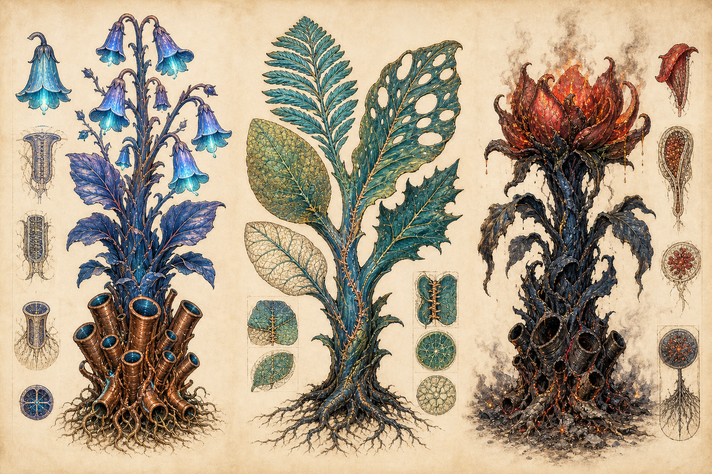

# 04｜全植物 IP 圖鑑

repo v0.1 明確命名三種薇蘿植物：**鐘管草、縫葉、燼冠**。其餘 116 頁植物圖版在現階段屬待開發標本，不能假裝已有名稱。本章完整整理三種正典植物，並提供往後新增條目的共同模板。

## 01｜鐘管草 Bellpipe

### IP 核心句

> 以潮汐吹奏自己的根，讓整片池岸在同一刻開花的「生態指揮家」。

### 形態

- 高度以成人膝至胸為常見範圍，群落中央個體可更高。
- 根座由多支中空、銅褐、具纖維紋的共生管組成；管徑不同，對應不同共鳴頻率。
- 葉片深靛、厚而柔韌，基部可見青色壓力脈。
- 花冠為下垂鐘形，邊緣有發光菌落，健康時發冷青光。
- 根管不是金屬製品；表面會長合、結痂、滲液，也會被汲蟲清理。

### 生理與生命史

- 池水漲退改變根管內的氣柱與水柱，產生低頻共鳴。
- 共鳴透過空氣、土壤和導管傳遞，校準鄰近植株開花節律。
- 潾者與燈蛾群在同步花期帶走繁殖體。
- 新群落必須同時取得光合組織、管器官幼體與發光菌落；只有種子不足以重建。

### 生態位

- 池環水位與連通性的「活體監測器」。
- 為黃昏授粉者提供集中食源。
- 根管空腔是部分汲蟲與微生物的棲所。

### 性格化讀法

- **人格印象**：合群、守時、敏感、愛把大家拉回同一拍。
- **喜劇面**：健康群落會互相校音，偶有一株慢半拍。
- **悲劇面**：斷網後無法收到停止訊號，會持續低鳴，直到儲水耗盡。
- 不把它畫成有臉的唱歌花；「個性」要從群體節奏和聲音表現。

### 化學與用途

- 汁液「**靛乳 Indolk**」低劑量可暫時增加局部導管通透、處理輕微栓塞。
- 過量會讓訊號擴散失控，造成錯誤開花、免疫混亂與水分浪費。
- 記脈院採集時要同時記水位、三月相位與音高，否則藥效資料無法比較。

### 脈枯狀態

1. 音高下降、不同株失去同步。
2. 根管積液或進氣，出現「喘鳴」。
3. 花冠延遲閉合，發光菌落過勞。
4. 斷網後持續單音低鳴，成為尋找栓塞點的聲學信標。

### 遊戲／動畫表現

- 玩家不看 UI 也能靠音高與拍差定位故障。
- 動畫重點是水位推動根管，而不是花朵自主唱歌。
- 角色動畫可讓珂潾以掌貼地、燼用隔離線測距、漣在水下回傳振動。

### 禁止偏移

- 不畫成銅製風琴或蒸汽龐克樂器。
- 不讓聲音成為無因果的魔法攻擊。
- 花色可變，但根管、水位、同步三件事不可移除。

## 02｜縫葉 Sutureleaf

### IP 核心句

> 把五種互不相同的葉片縫在同一副身體上，以合作換取完整光譜與完整防禦的「多職能協調者」。

### 形態

- 同一株穩定攜帶五種主要葉型；具體葉型可因池環而異，但功能必須不同。
- 葉與莖的接合處有明顯癒合縫，像組織自行縫合，不像人工針線。
- 主莖深藍綠，內有多條分流的糖運輸束。
- 建議五葉功能：
  1. 薄而寬：收集弱散射光。
  2. 羽狀：快速散熱與氣體交換。
  3. 厚蠟質：清季保水。
  4. 孔洞葉：讓風穿過、保護發光菌落。
  5. 刺緣葉：化學與物理防禦。

### 生理與生命史

- 是典型嫁接嵌合體，而非一顆種子固定長成五葉。
- 幼株先長出基礎軸，再透過綠脈或人工引導接收不同葉系。
- 五葉共同分享根座，但各自保留部分代謝偏好。
- 成熟的判準不是年齡，而是五個功能彼此達到穩定資源配比。

### 生態位

- 在光線破碎、病原多樣的縫林環特別成功。
- 五種葉面形成多層微氣候，為發光菌、汲蟲幼體與小型播遷體提供棲所。
- 葉型配方可當作某池環的生態「指紋」。

### 性格化讀法

- **人格印象**：勤勉、包容、善於協商，表面穩定，內部永遠在分配資源。
- **核心矛盾**：合作不是沒有衝突，而是持續把衝突調節在可承受範圍。
- **悲劇面**：斷網後五葉失去共享規則，彼此拉走糖與水，最終沿縫線撕裂。

### 化學與用途

- 生物鹼「**縫苦 Suran**」具強效止痛、麻醉與致命毒性。
- 不同葉型的縫苦比例不同；正確藥方必須指定葉型、季節、接合年齡與萃取濃度。
- 融脈教把五葉共身視為合一象徵；記脈院則強調五葉仍保持差異。

### 脈枯狀態

1. 癒合縫變亮，表示資源分流壓力上升。
2. 防禦葉開始抑制其他葉。
3. 葉片轉向彼此遮光，形成「自我競爭」。
4. 縫線撕裂，暴露內部導管並引來感染。

### 遊戲／動畫表現

- 嫁接系統可讓玩家調整五葉配方，沒有單一最佳解。
- 微風中五葉應有不同振幅與頻率，但主莖保持整體節奏。
- 情緒場景可用「五葉是否朝同一光源」暗示群體協調。

### 禁止偏移

- 必須是生物癒合，不是布料拼貼。
- 五葉不是五張隨機裝飾；每張要有功能。
- 不把「融合」畫成完美無衝突的烏托邦。

## 03｜燼冠 Embercrown

### IP 核心句

> 不是邪惡花朵，而是一株失去網路免疫、在硫化與發熱中燒壞自己的病人。

### 形態

- 藍黑主體萎縮或不對稱增生。
- 花冠膨大成硫病紅，內部有高代謝發熱組織。
- 根部導管堵塞、空腔黑化，可見燼灰與礦物結晶。
- 葉片仍保留健康原型的輪廓，讓觀眾知道它「原本不是這樣」。
- 可有熱霧與少量紅光，但不可真的像永燃火焰。

### 成因

- 不是獨立古老物種，而是脈枯野化後形成的穩定病態植物型。
- 斷網使免疫與代謝抑制消失。
- 缺氧產硫環境提高硫化物負荷。
- 同源異位與畸形訊號讓花冠無限增生，成為毒物與熱的匯。

### 生態位

- 正常生態中沒有正面「職位」；但形成後會占據死脈邊緣、排除其他植株。
- 其灰分可中和局部硫化物，這使它同時是病徵、資源與政治爭議中心。
- 焚脈派視其為必須切除的燃料與藥材；記脈院想保留原型與病變資料；融脈教可能視其痛苦為合一前的最後反抗。

### 性格化讀法

- **人格印象**：發燒、孤立、過度防衛、渴望連回某個已不存在的整體。
- 它不主動「恨」其他植物；毒害是失控代謝的外溢。
- 視覺恐怖必須帶哀傷，不能只求酷炫。

### 化學與用途

- 燒成的「**燼灰 Emberash**」可中和局部硫化物，暫時保住一小段脈。
- 灰的效果有限，且焚燒會破壞種源、釋放毒煙並永久切斷部分網路。
- 這是焚脈派「以火治火」能成立、卻不能成為萬靈丹的原因。

### 狀態階段

1. 冠部泛紅、溫度略升。
2. 根管自閉、葉片黑化。
3. 花冠過度增生、揮發毒物。
4. 組織碳化或被焚脈派切除，留下可用但危險的灰。

### 遊戲／動畫表現

- 玩家接近時先感到熱、苦味和環境生物退避，再看見紅冠。
- 燼冠不是固定「敵人」；可以隔離、取樣、局部降硫、焚燒或放棄。
- 風中花冠不應像火焰飄動，而是沉重、含液、因內壓脈動。

### 禁止偏移

- 不畫成火元素植物、惡魔花或會主動噴火的炮塔。
- 不把燒毀視為無代價的正解。
- 病紅、黑化、原型殘影與堵塞根管四項至少保留三項。

## 四、未命名植物的共通分類

未來逐頁重畫 116 頁植物時，可用以下欄位，避免每株都只是換皮：

| 欄位 | 必填問題 |
|---|---|
| 標本 ID | 對應哪一頁掃描與哪個 folio？ |
| 穩定型／暫時型 | 它能跨世代維持，還是一次性嫁接狀態？ |
| 構成譜系 | 真菌、光合、固氮、儲水、發光中有哪些？ |
| 主要功能 | 輸水、捕光、防禦、繁殖、儲存、修復或傳訊？ |
| 接口 | 它如何接入綠脈，視覺上在哪裡？ |
| 播遷者 | 潾者、燈蛾、拱背獸或水流？ |
| 化學 | 低劑量訊號、中劑量藥、高劑量毒分別是什麼？ |
| 失控模式 | 斷網後怎麼壞？ |
| 性格印象 | 觀眾從行為讀到什麼，不使用人臉？ |
| 科學原型 | 對應哪個真實機制？ |

## 五、植物總體製作規則

1. 任何一株植物都不應只有「奇怪輪廓」，必須說明功能。
2. 根部一律是網路接口；普通鬚根只能當局部次級結構。
3. 至少一處可見多譜系癒合、器官外包或性狀傳閱。
4. 健康植物的奇異感來自合作；病態植物的奇異感來自協調失效。
5. 若設計能直接搬到地球魔法森林而不改，代表薇蘿辨識度不足。
