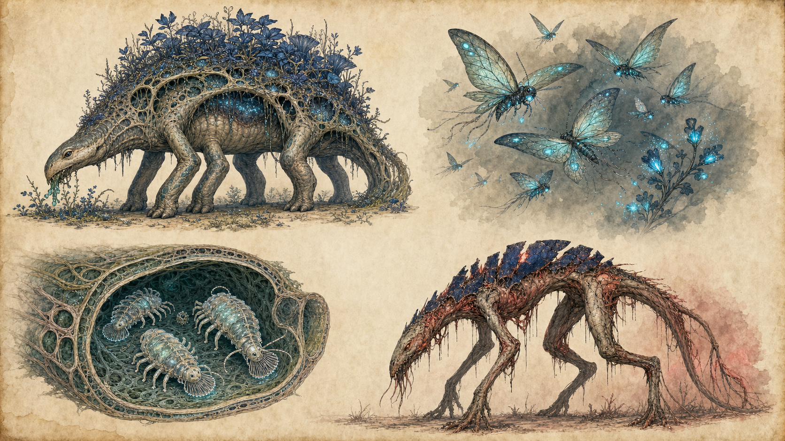
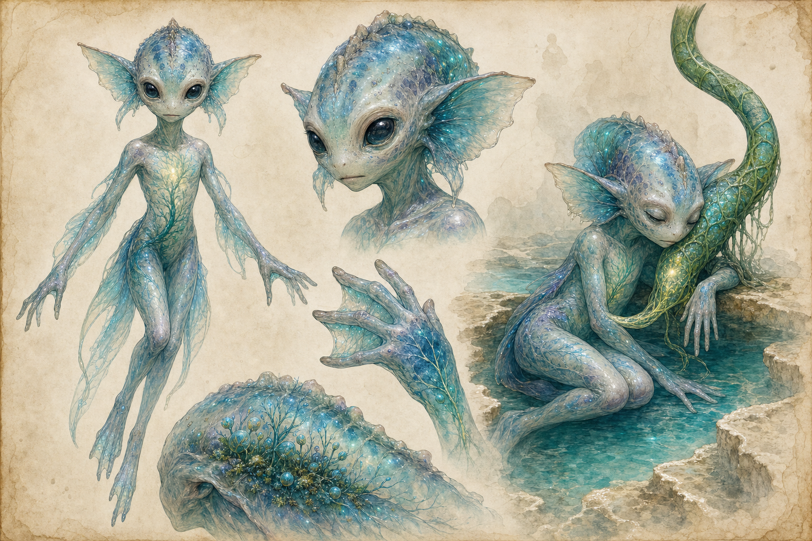

# 05｜全動物 IP 圖鑑

薇蘿動物不是綠脈之外的旁觀者。牠們多半內養光合夥伴、搬運繁殖體、清理導管或修剪植物，是生物圈的可移動器官。v0.1 明確命名五類：潾者、拱背獸、燈蛾群、汲蟲、裂獸。

## 01｜潾者 The Naiadin

### IP 核心句

> 在彼此斷開的池子之間搬運孢子、胚芽與訊息的半透明兩棲信使，是綠脈可移動的生殖系統。

### 外形

- 體型近似織脈者幼童，但明確非人類：珍珠半透明皮膚、寬鰭耳、蹼指、柔軟尾／臀鰭或背部感覺冠。
- 內部有靛藍—青色光合藻脈，光線沿水流與代謝緩慢移動。
- 身體表面覆有黏液披層，可攜帶孢子、胚芽與共生菌團。
- 與綠脈交接時會接上柔軟的綠色導管，像臍帶但不是永久束縛。
- 物種不設人類式性徵展示，所有視覺保持中性與尊嚴。

### 能量與攝食

- 由體內光合夥伴提供部分能量。
- 仍需攝取溫泉微生物、糖液、礦物與小型有機物。
- 長途播遷後需要在健康池中「充光、補菌、換黏液」。

### 感官與溝通

- 對溶於水的化學訊號極敏感。
- 以皮膚色脈、黏液配方、手勢、水壓脈衝與低聲鳴音溝通。
- 能理解綠脈的狀態，但不等於理解織脈者所有抽象語言。
- 年長個體可與強感受力織脈者建立跨物種「對話詞典」。

### 繁殖與成長

v0.1 未定義細節。本版採 C 層方向：

- 卵或胚囊固定在健康池的儲水共生體內發育。
- 幼體先取得基礎藻脈，之後經多池遷移逐步建立完整微生物組。
- 年齡不只看體型，而看背冠層數、黏液記憶與能承載的繁殖體多樣度。

### 群體性格

- **人格印象**：溫柔、實際、對「連得上／連不上」比對所有權更敏感。
- 對孤立水池有強烈照料衝動。
- 不浪漫化成無條件善良；牠們會避開病池，也可能為保全攜帶物而放棄個體。

### 脈枯影響

- 池間水路斷裂，遷移距離增加。
- 黏液中的繁殖體可能被硫化污染，迫使牠們自行脫落珍貴載荷。
- 失去補菌池後，體內藻脈暗淡、皮膚混濁。
- 被困潾者的命運能最直接呈現「網路斷裂不是抽象數字」。

### 遊戲／動畫

- 是水路導航、物種播遷、無文字訊息與道德選擇的載體。
- 游動像柔軟兩棲生物與水草的合體，不用人類蛙泳。
- 發光變化應有語法，不作隨機情緒燈。

### 禁止偏移

- 不畫成裸身人類、色情浴女、美人魚或可愛吉祥物。
- 不把牠們簡化為坐騎。
- 半自養、黏液載種、跨池播遷、導管交接四項不可移除。

## 02｜拱背獸 Archbacks

### IP 核心句

> 背著一座小花園行走的六肢巨型園丁，所到之處修剪、施肥並重新接上綠脈。

### 外形

- 大型、低重心、多肢；寬足分散活土壓力。
- 背部是多孔拱架，內有光合共生組織與小型植群。
- 頭部貼近地面，口器適合修剪而非連根拔起。
- 腹側可見排放富營養糞液或共生漿液的腺體。
- 健康個體背園是深靛、青光稀疏；不同池環有不同植物配方。

### 生態功能

- 修剪過度生長，維持光線與空氣流通。
- 攜帶枝段、孢子與共生菌跨越陸路。
- 糞液與脫落背園成分修復貧瘠活土。
- 足跡壓出小型水槽，成為潾者幼體與微生物的暫時棲地。

### 性格與行為

- **人格印象**：沉著、固執、社群導向、對既定遷徙路極忠誠。
- 以低頻胸腔聲和背園氣味辨識群體。
- 不喜歡突然的直線障礙；焚脈隔離線若切斷古道，獸群可能拒絕改道。
- 幼體好奇，會讓燈蛾在背園聚集；成體遇危機先把幼體圍在內圈。

### 能量

- 由背園供應部分糖，但仍需取食植物組織、菌毯與礦物泥。
- 半自養降低食物金字塔壓力，卻使牠們同樣依賴光、網路與共生平衡。

### 脈枯狀態

- 背園先失去同步，部分植株產毒。
- 獸體收到錯誤化學抑制訊號，焦躁、離群或攻擊障礙物。
- 若完全斷網，可能進入裂獸狀態；因此裂獸圖像應保留背拱或溫馴臉部殘影。

### 遊戲／動畫

- 遷徙路是大型動態關卡；玩家修復的不只是橋，也是整個園丁循環。
- 步態沉重但有六肢波浪式節奏，背園隨呼吸輕起伏。
- 可透過背園顏色讀出健康，而非顯示血條。

### 禁止偏移

- 不畫成背上長樹的普通烏龜或恐龍。
- 背園必須與身體生理相連，不能只是載貨。
- 溫馴不等於愚笨；牠們對路徑與群體有長期記憶。

## 03｜燈蛾群 Lampmoths

### IP 核心句

> 在漫長黃昏以生物光互相辨認、替螢光花完成授粉的群體訊號網。

### 外形

- 個體小，翼膜半透明，有葉脈式結構但不等同地球蛾。
- 腹部、觸鬚與翼端有青色發光器。
- 不同群落的閃光節奏和光譜略異，對應不同花群。
- 群飛時像一段可見的句子，而不是散亂亮粉。

### 生態功能

- 黃昏與長夜主要授粉者。
- 傳遞短距離病害與繁殖訊號。
- 為部分池中動物提供食物，把陸上光合能轉入水域。

### 性格與行為

- **人格印象**：好奇、群體聰明、對節奏極敏感、個體容易迷失。
- 單隻行為簡單；群體能選路、避開病光、形成「共識閃爍」。
- 會被錯誤病紅吸引或排斥，取決於族群經驗，提供非二元的危機行為。

### 繁殖

- 幼體可在發光花囊或濕潤菌毯中發育。
- 成蟲期與三月潮、藍昏長度同步。
- 群落辨識依微生物發光配方部分習得，因此可因池環隔離而快速分化。

### 脈枯狀態

- 正常花光變弱，燼冠病紅變強，導航語言被污染。
- 霧退後飛行更易脫水。
- 局部滅群會讓原本健康植物也因失去授粉而衰退。

### 遊戲／動畫

- 群體光序列可成為無文字導航和節奏謎題。
- 音效以極輕翼振、玻璃般短音和群體和聲構成。
- 不讓玩家大量擊殺；牠們是生態資訊，不是經驗值小怪。

### 禁止偏移

- 不直接畫成放大地球蛾。
- 發光必須有訊息功能。
- 群體才是主要角色單位，個體可愛度不是核心。

## 04｜汲蟲 Drawmites

### IP 核心句

> 平時替世界刷洗血管的微小清道夫；缺氧死後，自己的屍體反而成為堵住世界的沉積。

### 外形

- 肉眼可見到指節大小，視池環有差異。
- 多足、柔軟、能貼住導管內壁。
- 前端有扇形刮濾口器，清理沉積與微生物膜。
- 腸道帶淡青發光共生體，健康時可透過管壁看見流動亮點。
- 不畫成硬殼害蟲；牠們更接近柔軟濾食清道夫。

### 生態功能

- 清除導管沉積、維持水流。
- 控制部分微生物膜厚度。
- 將有機碎屑轉成可被固氮與真菌群再利用的細小顆粒。

### 性格與行為

- **人格印象**：勤快、低調、避光、以水流為秩序。
- 會沿壓力梯度列隊，群體方向直接顯示導管流向。
- 遇到受傷化學訊號會聚集，形成「活體清創」。

### 繁殖

- 卵／休眠囊附著於健康管壁。
- 水流加快與營養增加會觸發孵化。
- 潾者黏液可在池間搬運少量休眠囊。

### 脈枯狀態

- 對溶氧下降高度敏感，是最早死亡的動物之一。
- 死亡個體堆積在低流速彎道，加速栓塞。
- 產硫微生物利用屍體，進一步消耗氧，形成局部正回饋。

### 遊戲／動畫

- 玩家可透過導管內亮點密度診斷流速與氧氣。
- 修復不只是「清垃圾」；要恢復水流、補氧、移入健康微生物組。
- 微觀關卡能把行星危機縮小到一根管內看見。

### 禁止偏移

- 不當成噁心寄生蟲或必須消滅的蟲害。
- 牠們的死亡是症狀與加速器，不是脈枯最初原因。

## 05｜裂獸 Riven

### IP 核心句

> 「裂獸」不是邪惡血統，而是共生動物斷網、失去化學抑制後進入的飢餓野化狀態。

### 分類

v0.1 把裂獸描述為「原是溫馴的共生動物，斷網後行為與代謝失控」。為維持這句核心，本版將 Riven 定義為**症候群／生態型總稱**：

- 拱背獸可成為拱背型裂獸。
- 未來其他溫馴共生動物也可有裂獸型。
- 視覺板呈現的是一種代表性大型個體，不表示所有裂獸同種同形。

### 共通外形

- 原生輪廓仍能辨認。
- 光合板破裂、共生組織壞死或轉病紅。
- 身體過度消耗，肌肉與肢體拉長，代謝熱沿脈路浮現。
- 行為不再被綠脈的飽足／停食／群體訊號約束。

### 性格與行為

- **人格印象**：痛苦、混亂、被飢餓與錯誤訊號驅動。
- 牠們不是計畫傷害世界，而是無法再理解「夠了」。
- 有時會重複斷網前的照料動作，例如撥弄已死植物或守著舊遷徙路，增加哀傷辨識。
- 短暫接回健康訊號可能恢復片刻平靜，但不保證可逆。

### 生態影響

- 捕食與破壞提高，威脅潾者、種源站與孤立聚落。
- 移動時踩碎乾化活土、拖斷殘存導管。
- 屍體又成為產硫群營養，危機不因擊殺自動解決。

### 遊戲／動畫

- 戰鬥只是選項之一；可引導、麻醉、暫接訊號、開路或不得已終止。
- 動畫要在暴衝間插入原生溫馴動作，讓玩家看見牠曾是誰。
- 聲音由正常物種叫聲扭曲而來，不用標準怪獸咆哮。

### 禁止偏移

- 不設「裂獸王」作為擊敗即治癒脈枯的反派。
- 不用感染喪屍視覺取代共生崩潰。
- 任何裂獸設計都必須附上健康原型。

## 六、動物關係網

| 來源／對象 | 潾者 | 拱背獸 | 燈蛾群 | 汲蟲 | 裂獸狀態 |
|---|---|---|---|---|---|
| 綠脈 | 提供繁殖體與補菌池 | 提供背園與飽足訊號 | 提供花光與花蜜 | 提供管內棲所 | 連結中斷、抑制消失 |
| 潾者 | — | 沿獸徑跨池 | 搬運部分幼體或孢子 | 攜帶休眠囊 | 主要受威脅者之一 |
| 拱背獸 | 壓出暫時小池 | — | 背園供蜜 | 足跡與排泄物供營養 | 可成為裂獸原型 |
| 燈蛾群 | 為池中生物輸入能量 | 維持背園授粉 | — | 間接增加有機碎屑 | 病光造成導航錯亂 |
| 汲蟲 | 維持交接導管 | 清理背園接口 | — | — | 死亡加速斷網 |

## 七、動物總體製作規則

1. 每種動物都要回答「牠替網路做什麼」。
2. 半自養痕跡不可只靠發光；應有藻脈、光合板、曬光行為或補菌需求。
3. 生態危機中的敵意要能追溯到生理與連結失效。
4. 具名動物漣的個性不可被拿來代表所有潾者。
5. 動物與植物互為器官，食物鏈視覺應是網，不是單向吃與被吃。
