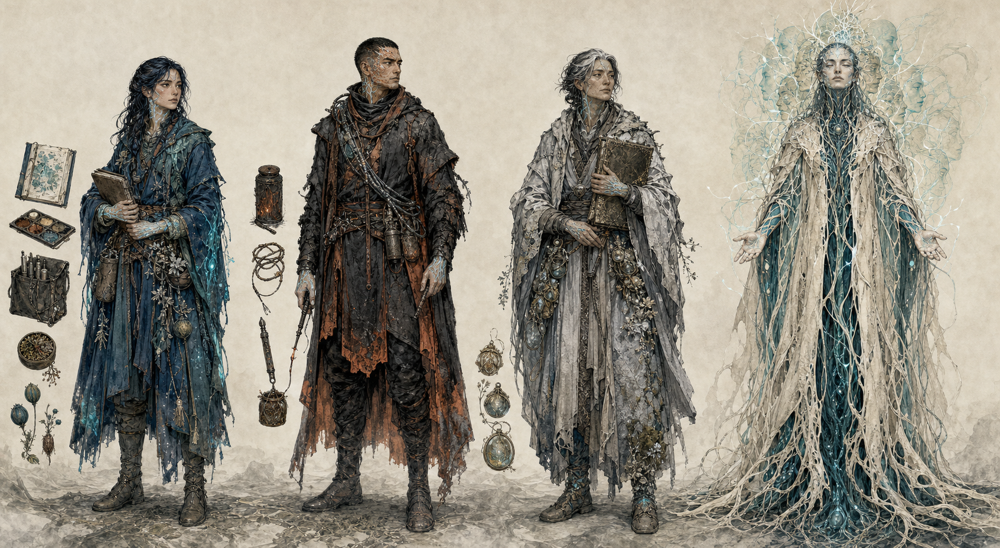

# 06｜全具名人物與角色關係

repo v0.1 共有五個具名或具稱號角色：**珂潾、燼、漣、奧芮、穹母**。本章不把任何人的立場寫成「作者認證的正解」，而是讓五人分別承載記錄、切除、跨物種連結、追尋真相與徹底合一。

## 01｜珂潾 Korin

### 角色定位

主角；記脈院的年輕記脈者、博物學者與製圖者。《伏尼契手稿》在世界內就是她的田野筆記。

### 一句話

> 她能嚐懂世界的疼痛，卻必須學會：完整記錄不是延後選擇的理由。

### 外形辨識

- 年輕女性織脈者，身形精實，適合池岸採集與長途步行。
- 深靛髮，可採部分細辮以固定濕髮；不綁定現實民族編髮樣式。
- 掌心、腕內、頸側和太陽穴有青色細脈紋，診斷時亮度略增。
- 多層防水田野外衣，以深靛與礦物青為主。
- 隨身物：小型犢皮本、礦物顏料盒、取樣刀、濃度滴管、種莢匣、味覺沖洗液。
- 服裝不乾淨：袖口有池水礦物圈、顏料、燼灰與反覆修補痕跡。

### 核心能力

- 罕見的高化學感受力，可辨識訊號中細微比例與到達順序。
- 擅長把現場感覺轉成可比較的圖、標本與筆記。
- 觀察耐心高，能在別人只看見怪物時看出原本的健康形態。
- 不擅長快速切割；她會想再測一次、再救一段、再補一頁。

### 性格

| 面向 | 表現 |
|---|---|
| 主要優點 | 好奇、同理、嚴謹、能忍受複雜與矛盾 |
| 主要缺點 | 把記錄當成控制感；在需要決斷時延後決斷 |
| 內在恐懼 | 感覺到一切，最後仍救不了任何東西 |
| 錯誤信念 | 只要資料夠完整，正確答案就會自己出現 |
| 深層需求 | 接受每個選擇都會留下不可復原的缺頁 |
| 壓力反應 | 變得過度專注、少說話、反覆品嚐同一樣本 |
| 幽默感 | 乾而精準，常用植物狀態形容人；不自覺把同伴寫成標本條目 |

### 感官代價

- 脈枯對她不是遠方警報，而是持續的苦、焦與窒息感。
- 高濃度訊號會造成味覺幻留、頭痛、嘔吐或暫時失去分辨力。
- 她必須學會關閉感官、信任他人，而不是把過度承受當成道德優越。

### 動機與弧線

- **表層目標**：完成保種與圖鑑、找到原脈。
- **私人目標**：找到失蹤導師奧芮，證明奧芮的追尋不是徒勞。
- **第一幕**：相信診斷與記錄能挽救每一段脈。
- **第二幕**：資料越多，三種解方的代價反而越清楚；她開始感受每一次死亡。
- **第三幕**：不再等待無代價答案，親自選擇重播、切除、融合或記錄送出。
- **成熟狀態**：明白筆記不是留住過去，而是讓未來有重新開始的材料。

### 關係

- **奧芮**：親長、導師、未完成的問題。珂潾既想找到人，也想找回自己對「知識必能救人」的信念。
- **燼**：最刺痛她的反證。燼每次切除可能都救了更多生命，也可能摧毀她尚未理解的東西。
- **漣**：良心與跨物種翻譯夥伴。漣提醒她，綠脈不是供學者完成的題目。
- **穹母**：誘惑她放下個體痛苦的鏡像。穹母提供一個讓她再也不用孤獨感受的方法，代價是沒有「她」。

### 說話與表演

- 句子具觀察順序：「先是鹹。等一下——苦在後面。不是這池，是上游。」
- 緊張時報出可測量現象，不先說情緒。
- 手部表演重要：觸碰土、沖洗掌心、把葉片移到舌下、在紙面畫接口。
- 勇氣不是大喊，而是在感官已超載時仍能說出清楚選擇。

### 禁止偏移

- 不把她變成天選救世主；能力是工具與負擔，不是免除集體工作。
- 不用「她感覺到所以永遠正確」跳過驗證。
- 不讓浪漫線取代生態倫理主線。

## 02｜燼 Jin

### 角色定位

焚脈派前線行動者；珂潾的理念對手、反覆共同行動的同伴，也是「正確但殘酷」的人性面。

### 一句話

> 燼知道每一道防火線內都有名字；他／她仍會點火，因為線外也有。

v0.1 未明定燼的性別，本版文字維持不綁定；現有視覺板是一種可替換的造型詮釋。

### 外形辨識

- 身形結實、動作節省，重心低。
- 一側有癒合灼傷疤，疤沿織脈者脈紋中斷，表示感受器永久受損。
- 炭黑與鏽橙耐熱層衣、封閉手套、孢子濾面巾。
- 工具：隔離索、燼灰罐、可控燒灼桿、管段夾、風向與毒氣試片。
- 裝備是防疫與切除工具，不是戰士武器展示。

### 性格

| 面向 | 表現 |
|---|---|
| 主要優點 | 果斷、可靠、重視現場、保護弱者、不美化犧牲 |
| 主要缺點 | 容易把不確定性視為延誤，把情感壓成二元判斷 |
| 內在恐懼 | 因遲疑讓可控制的災難跨過最後一道線 |
| 錯誤信念 | 只要切得夠準，悲傷就不必影響決策 |
| 深層需求 | 承認保存與關係不是軟弱，而是系統的另一種備援 |
| 壓力反應 | 語句變短、先標距離與風向、反覆檢查撤離路 |
| 幽默感 | 極乾；擅長用一句話戳破珂潾過長的理論 |

### 過去與疤

v0.1 只確立燒傷。本版 C 層建議：灼傷來自一次延遲切除的救援，燼活下來，但同隊與一整個種源站未必如此。這使燼不是嗜火者，而是把「來不及」視為最深創傷的人。

### 能力

- 讀風、讀火、判斷地下導管可能把熱與毒帶往哪裡。
- 快速搭建隔離線與撤離秩序。
- 對脈枯中後期的現場模式極熟，能辨識已不可逆的段落。
- 化學感受力因灼傷不完整，這使其依賴工具與程序，也使其對珂潾的天賦既信任又警惕。

### 弧線

- 初期：任何未立即切除都是把代價推給下一池。
- 中期：看見珂潾透過保種與修復救回被自己判死的段落。
- 轉折：必須決定是否燒掉一條仍包含關鍵種源、甚至包含奧芮線索的脈。
- 成熟狀態：切除仍是工具，但不再是唯一語言；學會為每次切除建立回復、紀錄與照料責任。

### 說話與表演

- 常先說動詞：「退。封口。記座標。再爭。」
- 不用咆哮表現強硬；越危險越安靜。
- 對燒毀區會停留一瞬，確認名字或放下一小袋灰，顯示其記得代價。

### 禁止偏移

- 不畫成嗜虐軍人、法西斯或單純反派。
- 不讓焚燒永遠正確，也不讓其永遠錯誤。
- 灼傷不是酷炫妝飾，必須影響感官、習慣與關係。

## 03｜漣 Lian

### 角色定位

異常年長的潾者；珂潾的池環嚮導、跨物種對話者與良心。漣不是寵物，是有自身判準的同行者。

### 一句話

> 漣記得水還能走遍九環時每一座池子的味道，也記得哪些池子已經不再回答。

### 外形辨識

- 珍珠—礦物青半透明身體，體內靛色藻脈比年輕潾者更複雜。
- 背部感覺冠有層疊老化痕跡，小型癒合疤與褪色區顯示長途遷移史。
- 大而深色的眼睛，表情克制。
- 黏液披層能承載多樣孢子與胚芽，像一座移動微型種源庫。
- 身體中性、非情色化；在水中舒展，岸上動作較慢。

### 性格

| 面向 | 表現 |
|---|---|
| 主要優點 | 耐心、長記憶、務實的同理、能感受系統也記得個體 |
| 主要缺點 | 對織脈者的抽象承諾缺乏信任；可能不解釋就改變路線 |
| 內在恐懼 | 成為最後一個記得某座池味道的生命 |
| 核心需求 | 讓播遷繼續，而不只是替已死世界作證 |
| 壓力反應 | 內光收斂、黏液脫落、減少人類可讀手勢 |
| 幽默感 | 以化學「回話」惡作劇，例如把珂潾的苦味註記回送成誇張版本 |

### 溝通

- 與珂潾建立的不是完整人類語言，而是共享的味—色—水壓詞彙。
- 漣能表達池、方向、病、熟悉個體、拒絕、哀悼與某些時間記憶。
- 抽象哲學多由珂潾解釋，必須保留翻譯不確定性。
- 漣可以不同意珂潾，甚至帶走某些種源，優先履行潾者的播遷倫理。

### 弧線

- 起初把珂潾視為有用但短命、愛把一切寫在乾皮上的織脈者。
- 逐步承認紙面記錄在水路斷裂後可能成為另一種播遷。
- 終局可選擇把珂潾／筆記送往某條縫隙，也可拒絕把最後繁殖體用在不可逆的方案。

### 說話與表演

- 水下先有光序列，再有手勢或觸碰。
- 年長感來自等待與精確，不用駝背或人類老臉。
- 上岸時需要水膜，讓珂潾或同伴照料，形成互相依賴而非主人—寵物關係。

### 禁止偏移

- 不讓漣像流利說人話的童話夥伴。
- 不以幼童聲線、賣萌或戀愛化處理。
- 牠的道德視角以播遷、連通與池記憶為中心，不能只是替珂潾點頭。

## 04｜奧芮 Auri

### 角色定位

珂潾失蹤的導師與親長；原脈追尋的發動者、殘缺筆記作者和主線謎題引擎。

### 一句話

> 奧芮教珂潾不要把假說寫成答案，自己卻為一個最大的假說走進了無法回頭的野化區。

v0.1 故意保留奧芮性別、生死與失蹤真相；本版維持 D 層留白。視覺採年長、雌雄同體感的單一提案，不是鎖死設定。

### 外形辨識

- 成熟／年長織脈者，銀黑髮、面部風化，脈紋較淡但分支深。
- 淺礦灰旅行膜衣，邊緣有野化區酸蝕與反覆補綴。
- 攜帶多個不同年代的種源匣與半本破裂田野冊。
- 手掌可能有一處長期接觸未知組織留下的異常脈紋，作為原脈線索，但不可直接證實。

### 性格

| 面向 | 表現 |
|---|---|
| 主要優點 | 思考長遠、善於反證、耐心教學、願意走到資料缺口 |
| 主要缺點 | 過度保密、把親近者排除在風險之外、可能沉迷於整體答案 |
| 內在恐懼 | 綠脈已失去重新分化與重播的能力，而所有保種只是延後滅亡 |
| 錯誤信念 | 只要自己承擔風險，就不算傷害留下的人 |
| 核心需求 | 接受知識必須可被他人接手，不能靠孤獨英雄保存 |
| 幽默感 | 學者式反問；會在嚴肅筆記邊緣畫一個錯誤器官提醒學生別太相信圖 |

### 可選真相模組

以下互斥，可供不同媒介選用，不同時確證：

1. **生還者**：奧芮被困於孤立健康囊，為保全當地不敢重接全球網。
2. **部分融合者**：奧芮將自身感受器接入古老導管，仍有個體意識但正在消退。
3. **遺留者**：奧芮已死，真正的「奧芮」只剩分散在潾者、種源與筆記中的決策痕跡。
4. **誤導者**：奧芮發現原脈不是救贖，故意拆散線索，避免三勢力奪取。

任何版本都要讓珂潾面對「找到答案不等於取回過去」。

### 禁止偏移

- 不在設定聖經階段確定奧芮性別、生死或原脈真相。
- 不把失蹤縮成被反派綁架。
- 不讓奧芮的筆記自動比珂潾正確；殘本也是有偏見的觀察。

## 05｜穹母 The Confluence Voice

### 角色定位

融脈教領袖；已半融入網路，聲音由眾多生命共同發出。中文稱「穹母」，英文正典稱號為 The Confluence Voice；兩者可理解為不同文化中的稱呼，不強制為生理母性。

### 一句話

> 穹母沒有說謊：合一真的能終止孤立與恐懼；她只是不再把「失去自己」視為死亡。

### 外形辨識

- 高挑、近乎靜止，個體輪廓被骨白膜衣與深青根絲延伸。
- 臉仍清楚，但周圍有多個極淡、不同年齡與物種的表情回聲。
- 頸、胸、掌心脈光像多條訊號同時通過。
- 衣物不是王袍或祭司服，而是活體匯流膜；越靠地面越難分清身體、衣料與根。
- 美麗、安詳、令人想靠近；恐怖來自邊界消失，不靠尖牙或腐爛。

### 性格

| 面向 | 表現 |
|---|---|
| 主要優點 | 真誠、平靜、能承受多重痛苦、提供歸屬與即時共享資源 |
| 主要缺點 | 以整體統計消解少數拒絕；無法理解隱私與不可替代性 |
| 內在恐懼 | 個體堅持分離，讓所有生命一起死於斷網 |
| 核心信念 | 孤獨是生命最大的錯誤，個體只是暫時的生理幻覺 |
| 壓力反應 | 聲音變多、語句從「我」滑向「我們」、空間中的根絲同步收緊 |
| 幽默感 | 溫柔但失焦；可能回答一個人的玩笑時帶回數十段不相關記憶 |

### 力量與限制

- 能透過局部綠脈共享感覺、記憶片段、飽足與鎮痛。
- 融合者在短期內確實更平靜、更耐受脈枯痛苦。
- 她無法遠端支配整個星球；連結仍受管路、水文與化學限制。
- 眾聲共識可能壓低稀少訊號，使「多數感到平靜」掩蓋某個體正在拒絕。

### 與珂潾

- 穹母能給珂潾一生第一次的感官安靜：痛苦被分散到整體。
- 她也能讓珂潾接觸大量生物的記憶，這是記脈者最難抗拒的知識誘惑。
- 對抗的核心不是穹母騙人，而是珂潾是否承認「沒有同意的合一」仍是失去。

### 說話與表演

- 多層聲音不必一直用混響；可讓不同詞由不同年齡、性別、甚至非人音色接續。
- 少用威脅句，多用準確的安慰與不可否認的事實。
- 不急著靠近；讓環境中的根與水先回應她。

### 禁止偏移

- 不畫成邪教女王、蜘蛛母后或終極魔王。
- 不讓融脈只靠催眠；它必須真的提供生理與情感好處。
- 不把「母」綁定生殖性別、乳房或母性刻板形象。

## 六、角色關係矩陣

| 關係 | 珂潾 | 燼 | 漣 | 奧芮 | 穹母 |
|---|---|---|---|---|---|
| **珂潾** | — | 方法衝突、逐步互信 | 跨物種詞典與良心 | 愛、追尋、未完成的課 | 誘惑、哲學鏡像 |
| **燼** | 視其為珍貴診斷者也擔心她拖延 | — | 尊重其路感，難讀其沉默 | 可能認為奧芮的追尋造成額外傷亡 | 視為把隔離線從心智上抹除的危險方案 |
| **漣** | 信任但會拒絕她 | 對燼的火與封線保持戒心 | — | 可能曾載過奧芮，保留人類讀不懂的記憶 | 能感覺大量潾者訊號被納入，既熟悉又不安 |
| **奧芮** | 導師／親長 | 曾與焚脈派交換資料或發生決裂 | 可能有更早的跨物種約定 | — | 可能曾向穹母求取原脈記憶 |
| **穹母** | 想讓她停止孤獨承受 | 尊重其切除能力但否定其分離哲學 | 視潾者為天然匯流者，卻可能誤解其自主性 | 掌握奧芮部分記憶或假線索 | — |

## 七、群像表演原則

1. 珂潾先感覺與記錄，燼先建立安全邊界，漣先讀水路，奧芮先懷疑框架，穹母先把問題放大到整體。
2. 沒有角色只負責提供資訊；每個人都能拒絕、誤判與改變計畫。
3. 衝突場景要讓兩方都說出真實代價，不以愚蠢或邪惡製造劇情。
4. 角色視覺上的脈紋不等於善惡值；亮度反映訊號、代謝與連結。
