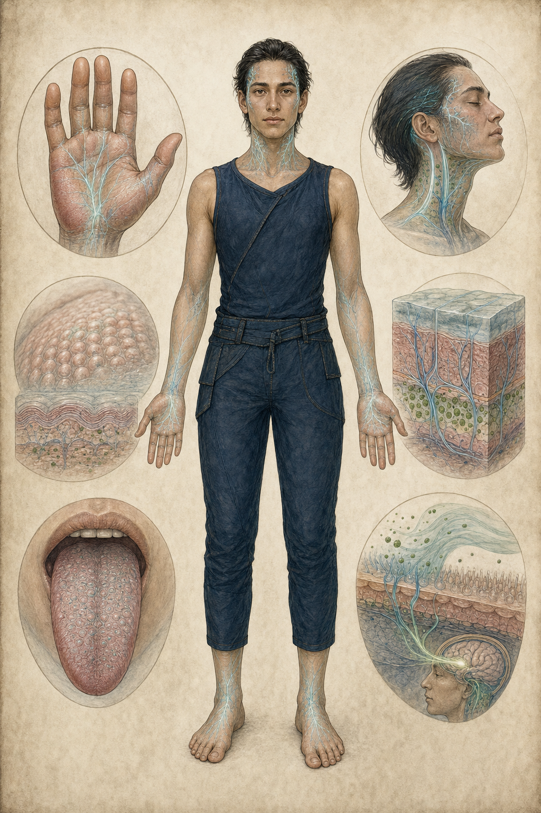

# 07｜織脈者、三勢力與日常文化

## 一、織脈者 The Weavers

### 物種特徵

- 外形近於人類，但掌心、舌、指腹、頸側和部分皮膚布滿高密度化學感受器。
- 皮下脈紋可見，承載血流、共生微生物與局部訊號放大。
- 能把氣味、味道、濕度與微量分子比例辨成近似語法的訊息。
- 不是綠脈主人；是最深入參與照料、嫁接、診斷與記錄的共生夥伴。

### 感官文化

織脈者的「讀」通常同時包含：

1. 眼睛看筆畫與圖。
2. 指腹讀筆序造成的表面與殘留分布。
3. 掌心讀整頁化學背景。
4. 舌或口腔感受極微量可溶訊號。
5. 依所在池水、季節與脈況補回語境。

這就是多通道書寫離開薇蘿後只剩一半的原因。製作上不可讓角色隨便舔任何古物；正式閱讀有取樣、稀釋、消毒和防毒流程。

### 身體與禮儀

- 握手過於親密，因掌心會交換大量化學資訊。
- 常見問候是露出手腕內側、讓對方看見脈紋是否平穩，再以手背輕觸。
- 隱私不只是不說話，也包括遮味、洗去殘留、戴無孔膜手套。
- 喪禮可能把逝者最後的無毒微生物組與種源分開保存，而非把整個身體送回網路。

### 服裝

- 服裝兼具濾霧、保濕、隔絕強訊號與攜帶樣本功能。
- 掌套可開合：工作時露出感受器，危險區封閉。
- 外衣以可修復菌絲氈、韌皮纖維與半透膜構成。
- 身分差異主要在工具配置和接口方式，不靠華麗階級飾品。

### 飲食

- 味覺高度敏銳，食物處理強調濃度與訊號乾淨。
- 健康池糖液、菌毯、可食光合囊、溫泉微生物餅與少量動物性蛋白皆可存在。
- 餐桌也是資訊場所：某些湯液可安全呈現當日池況。
- 強烈調味可能是娛樂，也可能暫時麻痺工作感受器，類似酒精與休假。

### 生育與家庭

v0.1 未定義生殖制度，不應過早鎖死。可確定的文化原則：

- 親族不只按血緣，也按共同照料的池、種源與學徒關係。
- 導師—學徒可具有親長地位，解釋珂潾與奧芮。
- 孩童先學安全辨味、池水界線與「不知道就不要寫成答案」。

## 二、記脈院

### 核心命題

> 先辨認差異，保存差異，未來才有重組的可能。

### 功能

- 田野調查、圖鑑、化學濃度記錄。
- 種源、菌團、藻系與潾者黏液樣本的分散保存。
- 嫁接治療與輕度栓塞急救。
- 尋找原脈／重播協定。

### 形象與物件

- 深靛、礦物青、骨紙白。
- 開放式層衣、多個小容器、可拆標本板。
- 標誌形狀可採「未閉合的環＋一條分岔脈」，但本版圖像不內嵌正式 Logo。
- 空間是種源庫、濕式標本室、味診台與繪圖桌的混合。

### 優點

- 最能保存生物多樣性與錯誤紀錄。
- 願意承認不確定性。
- 最有可能讓未來重新開始而不抹除個體。

### 盲點

- 收集速度永遠追不上崩潰。
- 溫和程序可能成為拖延。
- 誰決定「值得保存」仍是權力問題。
- 種源離開共生夥伴與環境後，未必仍能活。

### 內部分歧

- **完錄派**：盡可能完整，寧可慢。
- **急播派**：資料不完整也要先在安全孤島重建。
- **離世派**：把筆記與種源送出薇蘿，接受本地可能無法挽回。

## 三、焚脈派

### 核心命題

> 連結能傳遞生命，也能傳遞死亡；不切斷，就沒有剩餘可救。

### 功能

- 建立防火帶與化學隔離面。
- 切除中毒管段、焚燒燼冠、以燼灰中和局部硫化物。
- 撤離、檢疫、毒氣與風向監測。
- 維持孤立健康區的封閉生存。

### 形象與物件

- 炭黑、鏽橙、少量骨白。
- 耐熱菌絲層、封閉手套、濾面巾、隔離索、灰罐、管夾。
- 形狀為截斷線、夾口與狹窄保護帶。
- 不使用大面積軍旗與征服符號。

### 優點

- 在危機中最能立即降低傳播。
- 程序清楚、現場紀律強。
- 願意承擔「做了會被恨」的責任。

### 盲點

- 每次切除都讓全球網路更破碎，長期降低韌性。
- 火與隔離會摧毀未被辨識的種源、遷徙路與文化。
- 容易把不確定性判作最壞情況。
- 可能讓臨時緊急權力變成常態治理。

### 內部分歧

- **窄切派**：依珂潾式精密診斷做最小切除。
- **寬線派**：寧可過度隔離，也不讓災難越線。
- **守核派**：放棄九環大部分區域，只保少數核心。

## 四、融脈教

### 核心命題

> 個體從來不是獨立生命；承認合一，才能停止孤立造成的死亡。

### 功能

- 將織脈者與其他生命更深地接入局部網路。
- 共享疼痛、飽足、記憶片段與免疫負擔。
- 在斷網區建立高整合的「匯流體」，以集體調度資源。
- 提供脈枯時代強烈的歸屬、鎮痛與秩序。

### 形象與物件

- 骨紙白、深青、柔和脈光。
- 活膜衣、開放掌心、頸胸匯流紋、向地面延伸的根絲。
- 空間不採黑暗祭壇，而是安靜、溫暖、多人共享呼吸與水流的池室。
- 聲音層疊但不故意恐怖。

### 優點

- 短期內能降低孤立、痛苦與資源不均。
- 保存記憶的方式不是外部筆記，而是直接分散到群體。
- 面對行星級系統問題時，最不執著舊有個體邊界。

### 盲點

- 同意一旦融入集體便難以撤回。
- 少數拒絕訊號可能被多數平靜淹沒。
- 「我們都活著」可能掩蓋「不再有人能說我是誰」。
- 高度整合可能重演綠脈原本的單點脆弱性，只是換了尺度。

### 內部分歧

- **緩融派**：可逆、局部、保留私人記憶。
- **穹流派**：追隨穹母，接受長期深度匯流。
- **終合派**：主張全體生命一次完成不可逆合一。

## 五、三勢力視覺與倫理對照

| 項目 | 記脈院 | 焚脈派 | 融脈教 |
|---|---|---|---|
| 要保護什麼 | 差異與未來可能 | 剩餘可存活部分 | 整體連續存在 |
| 最怕什麼 | 無知中失去譜系 | 遲疑造成越線 | 個體堅持造成共同死亡 |
| 主要工具 | 記錄、種源、嫁接 | 隔離、切除、燼灰 | 接入、共享、集體調度 |
| 成功樣貌 | 小而多樣的新網 | 破碎但存活的核心 | 單一而穩定的超生物 |
| 失敗樣貌 | 只留下漂亮訃聞 | 世界被切成無法繁殖的孤島 | 生存者失去自我與異議 |

## 六、書寫與知識

### 多通道書寫

- 紙面符號：語音、句法骨架、順序標記。
- 顏料化學：濃度、情態、對象、危險級。
- 筆序與壓痕：時間節奏與訊號重音。
- 池水背景：地點與當時綠脈狀態。

### 為何地球無法解讀

- 化學殘留在跨世界、老化、清洗與保存中失真。
- 地球讀者沒有掌舌感受器與池水語境。
- EVA 類轉寫只能記符號，不是翻譯。
- 即使化學分析重建殘留，也仍缺少薇蘿生物學的對照詞典。

## 七、日常職業

除三勢力外，世界需要普通生活：

- **池守**：調節水位、監測潾者交接。
- **嫁接師**：維持拼裝植物的器官配比。
- **脈聽者**：以鐘管草和地面振動讀流速。
- **種源護送者**：在池環間搬運整套共生配方。
- **霧濾師**：管理孢霧、疾病與聚落通風。
- **背園照料者**：跟隨拱背獸遷徙，修復背部共生植群。
- **灰衡者**：測量燼灰用量，避免中和過度或毒物累積。

這些職業讓薇蘿不只存在於末世選擇，也有危機前的社會厚度。

## 八、文化級不可偏移項

1. 織脈者不是森林精靈；文化來自化學感官、池環與共生勞動。
2. 三勢力是危機下的制度化解方，不是三種服裝幫派。
3. 任何勢力都要能照顧人，也都可能傷害人。
4. 多通道文字不可簡化成「真正翻譯其實是某種地球語言」。
5. 日常生活必須顯示感官界線、取樣衛生與活土承重等物質限制。
