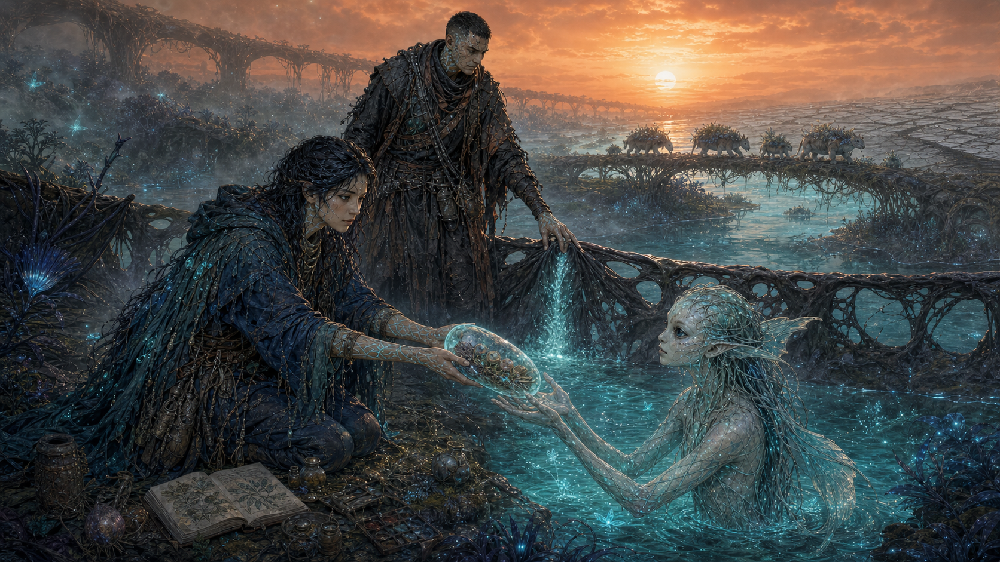
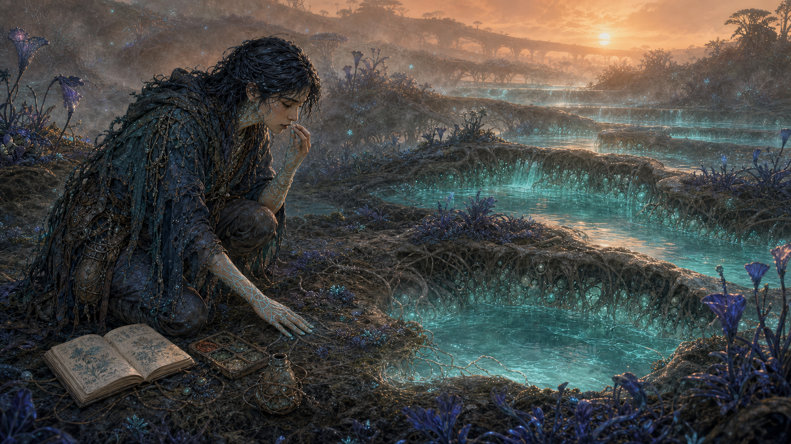
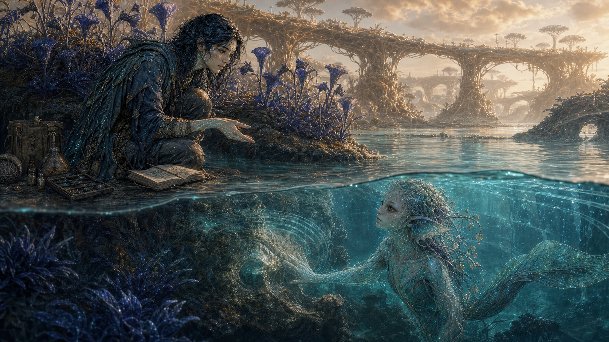
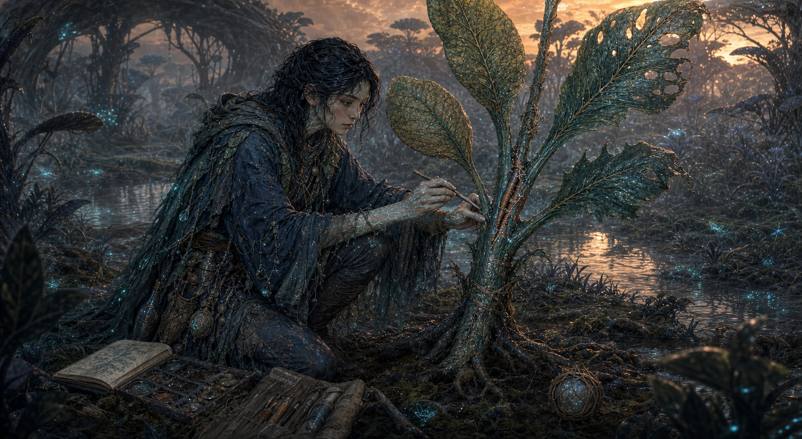
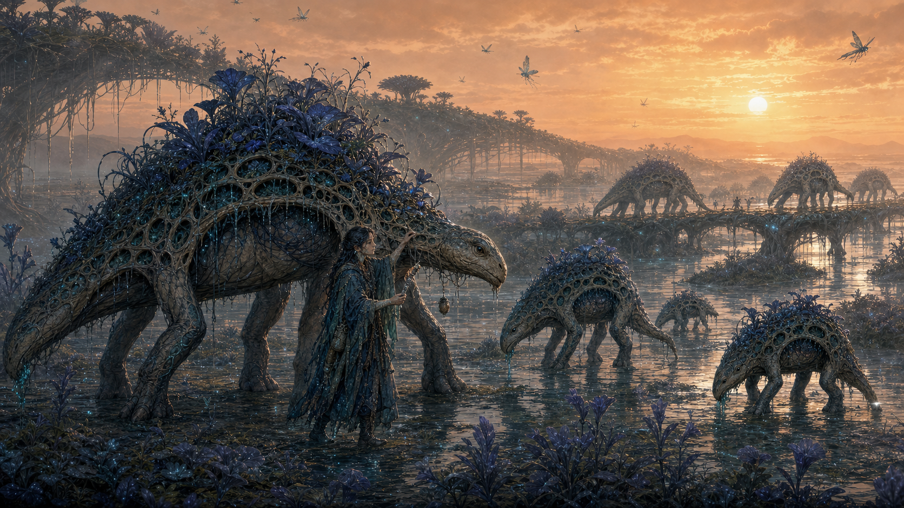
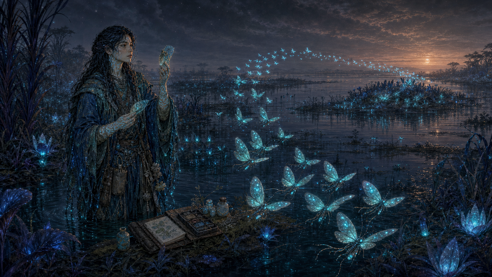
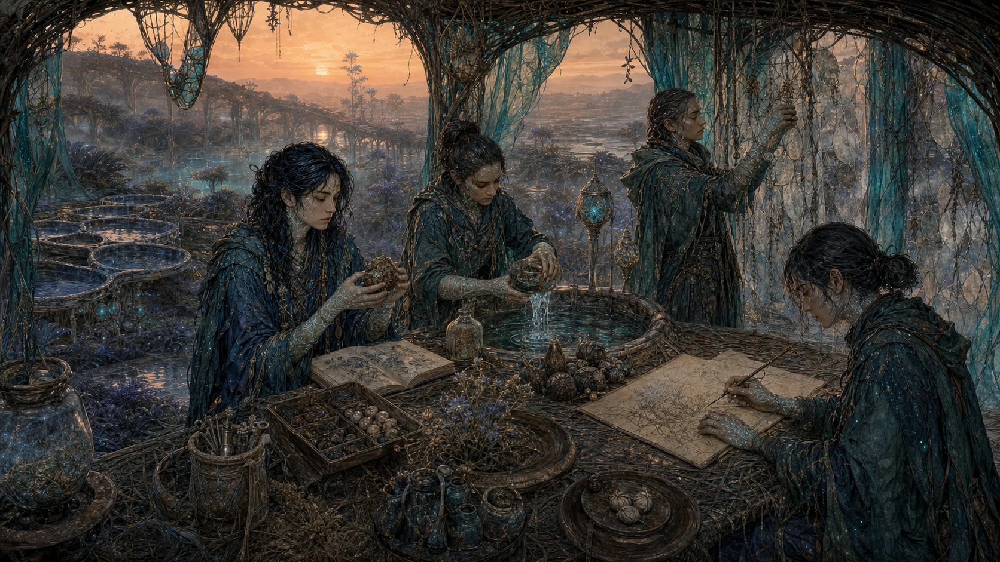
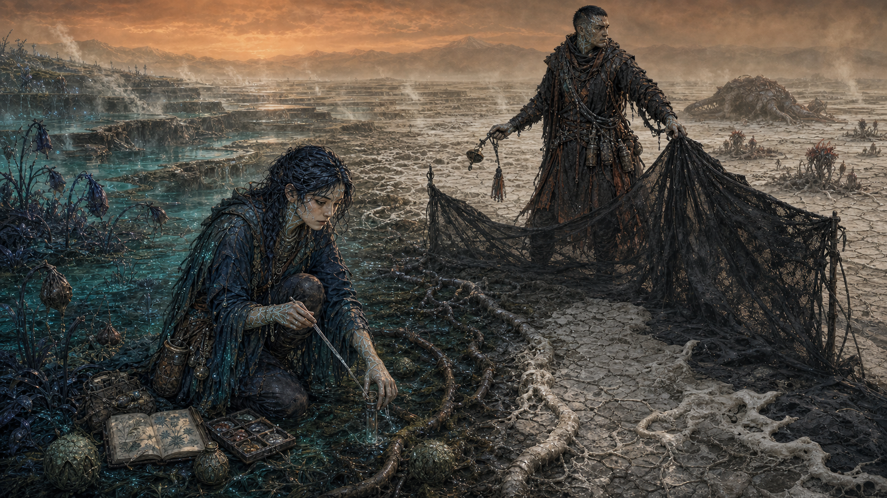
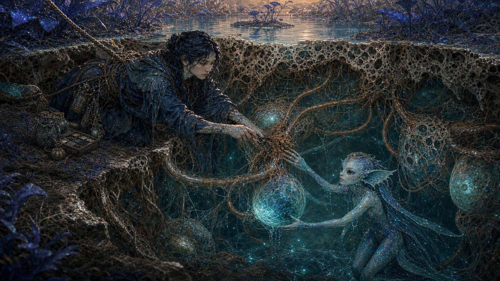

# 09｜珂潾在薇蘿：文章插畫集

**Korin in Vellora · 12 editorial illustrations · v0.3 · 2026-07-25**

本組 12 張寬幅插畫以主角**珂潾**為固定視點，讓她在九大池環、健康綠脈、脈枯前線、跨物種合作與倫理選擇中實際行動。它們不是額外的角色立繪，而是可以直接穿插在長篇文章、設定集、訪談、募資頁、小說章首或社群連載中的敘事場景。

## 使用原則

- 圖內不承載可讀文字；標題、圖說與正典層級由文章版面負責。
- 珂潾的臉、深靛濕髮、青色感受脈紋、多層防水田野衣與自然學者工具在全組保持一致。
- 圖像以 `16:9` 寬幅構圖為目標；實際檔案為高解析 PNG，可依文章版寬等比例縮放。
- 圖中的九池環細節多屬 **B／C 層視覺化提案**；原脈真相、奧芮生死與最終結局仍維持 **D 層留白**。
- 若圖像細節與 [`00-visual-language.md`](00-visual-language.md) 或 A／B 層文字衝突，以文字為準。

## 建議文章節奏

| 幕 | 圖像 | 主題 | 建議放置位置 |
|---:|---|---|---|
| 01 | 初泉環診斷 | 珂潾如何讀懂世界 | 主角／能力首次介紹 |
| 02 | 霧冠環過橋 | 世界尺度與探索方法 | 九池環地理段落 |
| 03 | 鐘潮環與漣對話 | 跨物種語言 | 潾者／化學訊號段落 |
| 04 | 縫林環修復 | 拼裝植物與照護 | 植物機制段落 |
| 05 | 脊園環遷徙 | 半自養動物與互信 | 動物生態段落 |
| 06 | 燈沼環燈蛾語法 | 非文字通訊 | 感官與聲光段落 |
| 07 | 靛丘種源庫 | 知識是集體工程 | 記脈院／文化段落 |
| 08 | 硫裂前線 | 診斷與切除的衝突 | 脈枯／燼段落 |
| 09 | 活土內部搶修 | 綠脈是基礎建設 | 活土／生命系統段落 |
| 10 | 靜心環遺留物 | 失蹤導師與留白 | 奧芮／原脈謎題段落 |
| 11 | 穹母門檻 | 安靜與個體邊界 | 融脈倫理段落 |
| 12 | 種源進入水路 | 成熟選擇與延續 | 結語／未來方向 |

## 01｜初泉環：先鹹，後苦

> 歐柯的低角度晨光穿過礦物霧；珂潾一手讀取活土壓力，一手品嚐經稀釋的水樣，把池環的「句子」拆成到達順序。

- **互動核心**：掌觸、滴管、味覺沖洗、筆記與現場交叉驗證。
- **世界資訊**：階梯泉、儲水共生體、根部接口、橙矮星長晨。
- **角色狀態**：好奇、專注，仍相信多一次測量就能救回每一段脈。
- **替代文字**：珂潾跪在青色階梯泉旁，以發光掌紋接觸活土並品嚐稀釋水樣，橙色晨光照過靛藍植物。

## 02｜霧冠環：橋也有脈搏

> 她不是在一條被建造的橋上行走，而是在一個仍會交換水分、承受壓力、決定是否讓旅人通過的器官上移動。

- **互動核心**：以掌心讀橋面壓力波，跟隨燈蛾群的方向閃光。
- **世界資訊**：高冠雲霧、集露杯、根—菌絲複合脈橋與垂直生態。
- **角色狀態**：謹慎；她的勇氣以步伐和測量呈現，不是英雄姿勢。
- **替代文字**：珂潾站在高空活體根橋上觸摸微光脈絡，燈蛾群穿過深靛樹冠與橙色雲霧指引方向。

## 03｜鐘潮環：水下的回答

> 珂潾讀到的是葉片、鹽度與延遲；漣讀到的是水壓、上游記憶與播遷路徑。兩種不完整的證據在水線上相遇。

- **互動核心**：珂潾讀鐘管草，漣在水下觸碰導管，以濃度羽流和壓力環互相翻譯。
- **世界資訊**：潮差、鐘管草、水下脈路與潾者感官。
- **角色狀態**：平等合作；漣是有自身判準的嚮導，不是寵物。
- **替代文字**：珂潾在花叢池岸伸手回應，半透明的漣在清澈水下按住發光導管，兩者隔著水面交換訊號。

## 04｜縫林環：修復不是回到原樣

> 她把兩段維管重新對齊，但沒有假裝裂口從未存在。新的縫線將成為下一片葉子的生長條件。

- **互動核心**：對齊維管、植物纖維固定、礦物封合與脈紋回饋。
- **世界資訊**：縫葉的五種功能葉、嫁接嵌合、慢流沼澤與活土接口。
- **角色狀態**：細緻、耐心，也暴露她對「再救一段」的執著。
- **替代文字**：珂潾蹲在五種葉形的縫葉旁，以細夾修合樹幹接口，工具與筆記攤在潮濕森林地面。

## 05｜脊園環：不需要韁繩

> 年長拱背獸主動放低肩部，讓珂潾檢查一小片萎蔫的背園。她留下的是種源註記，不是所有權標記。

- **互動核心**：檢查背園、收集自然脫落樣本、伴隨而非騎乘。
- **世界資訊**：六肢波浪步態、半自養背園、遷徙廊道與獸群修剪功能。
- **角色狀態**：溫柔但不擬人化；互信建立在長期行為上。
- **替代文字**：珂潾步行在多隻六足拱背獸之間，伸手檢查年長個體背上的靛藍植園，遠方獸群跨越脈橋。

## 06｜燈沼環：閃光有語法

> 她沒有模仿一個「字」，而是調整角度、亮度與間隔，讓燈蛾群把她的回應納入下一輪飛行。

- **互動核心**：用不同礦物色素的濾色葉測試群體光訊號。
- **世界資訊**：藍昏、黑水濕地、夜間授粉與群體閃光句法。
- **角色狀態**：驚奇，但仍以可重現的工具和記錄面對驚奇。
- **替代文字**：深夜濕地中，珂潾舉起兩片半透明濾色葉，成群青光燈蛾沿弧線飛向遠方花島。

## 07｜靛丘環：知識不是一個人的手稿

> 樣本先被沖洗、隔離、比較，再進入種源龕；珂潾的田野判讀只是一條證據，不是自動成立的答案。

- **互動核心**：四名記脈者分工處理、比對、製圖與維護濾幕。
- **世界資訊**：分散式浮基聚落、種源龕、孢子濾幕、水位尺與靛色顏料丘。
- **角色狀態**：從「我必須感覺一切」移向「我們共同驗證」。
- **替代文字**：珂潾與三名同僚在活體纖維棚內沖洗種莢、比較標本並繪製無字脈圖，遠方是橙光下的池環。

## 08｜硫裂環：線的兩側都有名字

> 珂潾要求再測一次；燼把隔離膜固定到位，但沒有提前落下最後一道封套。短暫的等待就是兩人此刻能給彼此的信任。

- **互動核心**：珂潾以滴管檢查栓塞導管；燼以無火程序控制風向與污染邊界。
- **世界資訊**：青濕到骨白乾區的梯度、排空池階、硫霧、窄黑隔離帶與遠方裂獸。
- **角色狀態**：感官超載與決斷壓力同時出現。
- **替代文字**：珂潾在濕潤與龜裂活土的交界取樣，帶灼傷疤的燼於乾區張開黑色隔離膜，遠方薄霧籠罩枯池。

## 09｜活土內部：把水送回器官

> 崩塌讓地表短暫成為剖面；珂潾解開導管纏結，漣把上游水壓導入透明儲水囊，池面才沒有繼續下降。

- **互動核心**：安全繩、活體導管解堵、水下壓力引導與跨介質協作。
- **世界資訊**：海綿型活土、菌絲網、儲水共生體、汲蟲與有機管線。
- **角色狀態**：不再獨自承受；她把自己無法讀取的水下部分交給漣。
- **替代文字**：活土塌口露出多孔組織和發光儲水囊，珂潾從地面解開導管，漣在水下托住囊體送入水流。

## 10｜靜心環：奧芮留下的不是答案

> 灰白衣料、熟悉的礦物墜飾、受潮頁片與一個手掌留下的化學殘影，只能證明奧芮曾經到過這裡。

- **互動核心**：以掌紋比對殘留訊號，辨認導師的野外快取。
- **世界資訊**：靜潮、深內海、古老匯流導管與活纖維小舟。
- **角色狀態**：希望與證據分離；找到線索不等於取回過去。
- **正典界線**：畫面不顯示奧芮本人，也不確證其生死或原脈位置。
- **替代文字**：鏡面般的內海旁，珂潾把發光掌心貼上古老導管的手印，腳邊散著灰白衣片、墜飾與受潮筆記。

## 11｜穹母門檻：第一次安靜

> 化學壓力波進入珂潾的感受脈後，苦、焦與窒息第一次同時退去。她仍用另一隻手把筆記抱在胸前。

- **互動核心**：兩指接觸、訊號與痛苦分攤、主動保留個體邊界。
- **世界資訊**：活膜匯流、融脈網路、重疊生命痕跡與共享感官。
- **角色狀態**：穹母提供真實 relief，因此選擇才真正困難。
- **正典界線**：不把穹母畫成純反派，也不判定珂潾最後是否接入。
- **替代文字**：幽暗活膜室裡，珂潾抱著筆記伸出手指，與根網中的穹母掌心相觸，青光沿兩人的生物脈絡傳遞。

## 12｜讓種源進入水路

> 珂潾封存的是副本，不是唯一真相；漣接住的是多樣種源，不是命令；燼打開的是經過測量的窄口，不是撤除所有邊界。

- **互動核心**：珂潾交付活體封存囊、漣承接水路播遷、燼控制隔離口。
- **世界資訊**：恢復流動的池環、仍保留的乾化疤、遠方拱背獸與修復脈橋。
- **角色狀態**：成熟不是找到無代價答案，而是清楚選擇、共同承擔並留下未來材料。
- **正典界線**：這是可供文章結語使用的 C 層象徵畫面，不鎖定遊戲或小說唯一結局。
- **替代文字**：橙色日出下，珂潾把裝有種莢與筆記副本的透明活囊交給水中的漣，燼在後方打開一道窄隔離口。

## 檔案與排版

- 原始檔案：[`assets/ip-bible/korin-article/`](../assets/ip-bible/korin-article/)
- 生成規格：[`KORIN_ARTICLE_PROMPTS.md`](KORIN_ARTICLE_PROMPTS.md)
- 建議文章寬度：桌面版 `1200–1600 px`，行動版使用容器寬度 `100%`。
- 圖說建議置於圖片下方，以骨紙白底、深靛字與礦物青分隔線呈現。
- 若裁切為社群比例，優先保留珂潾的臉、至少一隻手、正在互動的生物／器官與環境狀態；不可只裁成通用角色肖像。
